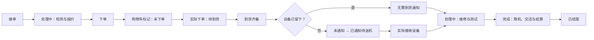

# 维修表格、图形化状态与操作层级规划

## 2026-10-04 当前实现：手机连续两行与轻量按钮

用户接受推荐并要求同时美化按钮。正式源码已采用连续白色列表，标准工单两行93px，取消每单卡片外框及行间空隙；长型号、多条业务事实自然增高。上行设备／客户／阶段，下行配件／跟进／负责人时间；768px以上保留完整六列与窄桌面面板内横向滚动。

复用原`.repair-row-parts`、`RepairStageControl`、`RepairContactControl variant="list"`和语义token：配件浅紫、跟进浅灰、阶段沿状态色，减少重复边框和阴影；所有主要入口仍至少44px。列表跟进采用真实短文案“跟进”，适用通知／报价／久等／欠款及交还事实在同一个按钮中完整排版，只读用户仍能读取事实；不采用预览里的CSS伪元素文案或绝对定位叠字。默认详情组件布局及写入、授权、采购与返回恢复规则沿用原实现。

实际源码定向22项及完整84项Chromium／WebKit检查通过，375／390／414标准行均93px、五点命中、完整所属行边界、窗口开闭及焦点、长供应商窗口完整读取、1440／1024桌面、状态字节和返回位置通过。长供应商仅手机列表省略，实际窗口完整核对；292业务、strict TS、lint0错误（1既有warning）和正式后台build通过。发布及线上版本最终记录在PROJECT_MEMORY；截图为本地合成数据，实体iPhone未测。

当前截图：[390px](../.local/ui-proof/repair-mobile-implementation/chromium-desktop-390.png)、[1440px](../.local/ui-proof/repair-mobile-implementation/chromium-desktop-1440.png)。检查与发布证据位于`.local/repair-mobile-implementation/`。

## 2026-10-04 历史设计预览（正式实施之前）

用户截图指向分组下的单条工单，要求沿桌面表格风格适配手机、去掉每单卡片、垂直高度约为旧版三分之一。以下保留实施前的方案与临时样式预览：当时线上main为`01f78b796b0110e1b5e452784b705c58525ba0d2`，生成图片及临时CSS尚未写入正式实现；当前结果以上方最新实现节为准。

### 推荐布局

- 每个分组是一段连续白色列表，保留分组名称、数量、色条及44px折叠开关；零单分组仍显示。不为每张工单加外框、圆角或独立空隙。
- 标准工单两行。第一行44px：小设备图标、型号与客户紧邻排列，右侧维修阶段。第二行44px：供应商／配件按钮、跟进按钮、负责人与更新时间。内上下间距共4px加1px分隔线，标准高度93px；主体14px，次要文字12–13px，表单输入继续16px。
- 手机同一行只保留短操作“跟进”，可访问名称继续完整“联系与跟进”。只有一条报价／通知事实时并入同一入口内短状态；多条状态仍完整显示并允许自然增高，不把报价待回复、已通知、久等或欠款混为一个事实。
- 长供应商名称在列表一行省略，原按钮标题和实际供应商窗口保留完整名称；已验证点击后真实组合框完整读取同一供应商。长型号可换行，行高为最小值，避免覆盖客户、阶段或下一单。
- 点击行的设备／客户区域进入原详情；配件、阶段、跟进仍走现有入口和权限。保留当前返回展开组／视角、空分组、手动阶段和采购／通知的独立逻辑。768px以上保持现有桌面六列。

### 预览与自检

内置image_gen做两轮概念稿，第二轮纠正分组颜色及独立卡片轮廓；选用真实本地应用＋临时注入CSS检验可落地方案。第一次长供应商全名自动换行再次撑高，因此改为列表省略、窗口完整核对，并补了对应点击断言。

375px下同一合成工单旧高度257.234375px、候选93px，减少64%。375／390／414在Chromium及WebKit模拟环境检查：配件／阶段／跟进按钮至少44×44、五点实际命中且完整位于本行；实际开窗、取消与焦点返回；长型号、长供应商和多条取机／跟进事实。1440／1024桌面几何与业务存储前后比对。最终结果与截图见下列本地证据；没有正式业务写入，未测实体iPhone，不把这些检查当线上实施或全量CI。

- [真实390px预览](../.local/ui-proof/repair-mobile-dense/actual-chromium-desktop-390.png)
- [WebKit375px预览](../.local/ui-proof/repair-mobile-dense/actual-webkit-touch-375.png)
- [长内容与跟进状态](../.local/ui-proof/repair-mobile-dense/long-webkit-touch-414.png)
- [第二轮概念图](../.local/ui-proof/repair-mobile-dense/concept-v2.png)
- [生成提示词](../.local/repair-mobile-dense/imagegen-prompts.txt)
- [定向验证](../.local/repair-mobile-dense/verification.json)
- [临时样式](../.local/ui-proof/repair-mobile-dense/preview.css)

### 正式落地顺序

1. 手机列表作用域改为上述紧凑网格，继续保留普通parts-cell和宽度100%的按钮，防止重现Linux WebKit跨行误点；桌面规则独立。
2. 在既有联系组件的列表手机变体提供短文案及事实排版；只读／无权限、单条及多条通知／跟进使用同一数据，详情及默认使用方保持原语义。进价门控、保存与幂等、阶段和返回状态不重写。
3. 正式代码完成后执行受影响浏览器回归、长内容／五点命中及LinuxCI、TS／lint／build，随后按既有发布授权核对main、Vercel及实际资源；结果记录在最新实现节与PROJECT_MEMORY。

2026-10-04 云端WebKit窄桌面补充：长供应商按钮曾高于所在工单行，底部点击误命中下一单。仅改flex为grid曾无法修复，已在官方同版本Linux WebKit环境复现。配件入口增加普通`.repair-row-parts-cell`，内层按钮宽度100%、图标／文字使用明确网格列，手机行列定位归单元格；普通单元格让完整按钮高度参与本行布局。相同Linux环境原用例失败→包裹后通过，不断言未证实的引擎内部原因；两端沿用同一入口、token和44px目标。保留五点命中要求，补按钮必须完全位于本条工单范围的断言；诊断记录具体坐标、命中元素及裁切祖先。同一Linux环境完整82项及Mac20项定向浏览器检查通过，严格TS、lint零错误和正式构建通过；最终发布后的云端结果仍须另核对。

## 2026-10-04 当前执行方案：进一步精简与返回恢复

本节覆盖同日较早的列表方案。重新核验原Figma任务弹窗 `12327:136741` 截图，以及任务字段、头部和状态标签的完整设计上下文，使用紧凑字段行、浅色短标签、细边框和明确主次操作；适配现有CSS/token、系统字体和Lucide，不引入模板计时、头像或新UI库。

| 位置 | 本轮实施 |
| --- | --- |
| 设置→订单管理 | 维修状态／配件分组的重命名、拖动排序统一移入，仍须settings.edit并沿原保存与冲突检查。列表移除原管理／展开全部／收起全部工具块，保留各分组自身开关。 |
| 列表工具区 | 搜索、数量和筛选入口一排；分组视图与排序为紧凑带名称控件；阶段／配件筛选按需展开，显示已选条件，可重置。 |
| 工单行 | 设备型号 → 客户 → 供应商／配件按钮 → 手动维修阶段 → 联系／跟进 → 负责人／更新。移除型号下内部ID和独立采购进度列，ID仍可搜索、读详情／打印；真实采购数量与未选项目在配件窗口／详情／采购车读取。 |
| 供应商与配件 | 直接列接单已有项目，电脑紧凑项目行＋供应商／报价／获权进价，手机同一字段顺序；每项读取实际采购状态。新供应商选择只显示“保存后加车”，事务成功后才“已加购物车”，仅报价不生成采购；已下单记录锁定供应商／进价，报价沿旧规则可改。 |
| 阶段选择 | 保留确认窗口，但缩小层级和间距，突出当前／所选阶段、统一图标和选中标记，保留必要原因、冲突及提交禁用，不把阶段当作到货／交还／收款事实。 |
| 详情 | 左列故障／维修需求→供应商／配件→客户签名连续排列；右列概况→联系→随件→照片独立排列。两列不共享行高，项目多寡不产生中间断层；手机按主任务顺序单栏显示，签名同样贴近配件区并保持原快照。 |
| 返回列表 | 同标签详情→返回／浏览器后退恢复筛选、分组视图、排序、已展开组、纵向与表格横向位置。缓存按账号／成员版本／门店／权限隔离；搜索只存模块内存，不把客户搜索文本写入sessionStorage。首次无记录沿默认；坏存储可继续操作，旧scope响应不覆盖新账号。 |
| 接单联系 | 用户选择“主要记录报价沟通，也需要待回复”。每单提供联系入口，记录已沟通报价／未接通／待客户回复与说明、时间和操作者；与到货通知／取机通知及修好久等／欠款分开。读取同源报价，不自动证明客户同意维修或改维修阶段。 |

验收覆盖桌面／手机四宽度、无／少／多项目与长内容、实际窗口输入和保存、报价-only／进价权限／已下单锁定、取消不写、版本冲突、设置分组权限与拖动、接单沟通保存→详情历史→刷新、详情／返回按钮／浏览器后退位置与身份隔离。只用独立本地合成数据写入，不发送客户消息或真实供应商订单。完成证据及发布状态在PROJECT_MEMORY最新节记录。

本轮验收：292业务、完整82 Chromium／WebKit、10组隔离真实后台及正式build通过；返回保留精确纵横位置断言，四宽度1440／1024／390／375无整页横溢。独立权限／数据复核无确证新问题；本地单次报价保存168ms，只作实验室样本。全部写入合成数据，实体iPhone未测。发布状态见PROJECT_MEMORY。

## 2026-10-04 上一轮适配方案：工单列表两端统一

目标是让工单事实容易扫读、操作入口容易辨认，降低整行按钮和状态的视觉负担。此次重新读取用户原 Figma 文件的任务页面 `12327:116272` 截图；整页设计上下文过大，因此再读取分组 `12327:117918`、数据格 `12327:117928`、短状态 `12327:117940`、搜索与工具层级 `12327:116281` 的完整上下文。沿用其中白色底、细线、分组色条、短标签和主次操作层级；业务图标复用项目 Lucide，字体保留已确认的系统字体，不照搬模板计时、头像、装饰点阵或另一套主题。

| 区域 | 桌面（768px及以上） | 手机（767px及以下） |
| --- | --- | --- |
| 标题操作 | 标题、扫码图标、采购车、批量到货、新建工单；新建保持紫色主操作 | 标题与菜单一行；四个44px操作收在下一行，避免原本多次换行 |
| 搜索与筛选 | 搜索优先；下拉统一圆角、字体、44px高度和细边框 | 16px搜索输入与筛选按钮同排；筛选按需展开，分组管理沿原权限 |
| 分组 | 独立白色分组面板，色条＋名称＋浅灰数量，细线分隔表头 | 同样的色条和数量；展开后是单栏工单卡片，空组仍存在 |
| 一张工单 | 型号／工单号、客户、供应商／配件、真实采购进度、负责人／更新、阶段、通知／跟进按列对齐；最小80px，不裁剪额外事实 | 型号与阶段 → 客户 → 同一个配件按钮 → 采购进度／待核对 → 适用通知／跟进 → 负责人和更新；联系人电话在详情读取 |
| 操作与状态 | 每单只保留一个配件入口；阶段是短色标签，但实际点击区域至少44px；通知事实与联系按钮在同一列 | 配件按钮带图标、名称和箭头，整行可点；阶段与联系按钮同样保留44px目标 |

维修阶段、加车／下单／到货数量、客户通知、久等／欠款及实际交还继续分别读取原领域事实。不增加虚构完成百分比，不自动改维修阶段，不改变报价／进价权限或历史。重复配件按钮移除后统一保留 `repair-action-<id>`，保存／取消返回可见入口；手机恢复原先被CSS隐藏的待核对项目提示。

仍只有电脑和手机两套布局：窄电脑保留全部列，只在表格内横向滚动。Stage／Contact增加 `list` 外观变体，默认详情布局不变；扫码复用 IdentifierScanner已有的iconOnly能力。沿现有CSS/token落地，不引入UI库或Figma临时资源链接。

验收范围：1440／1024／390／375的真实页面、长型号／供应商、部分选件、通知／久等／欠款、只读与财务权限、弹窗打开／关闭及焦点、阶段换组、刷新恢复；检查采购和通知原交互、两套详情的默认控件。完成证据与上线状态见PROJECT_MEMORY最新节。本段为当前方案，下方2026-09-30阶段记录保留追溯。

2026-09-30。先分析再执行：本轮落实现有采购分组的折叠、更新时间排序与图形化摘要；六主组、设备交接、通知和结案仍按 [闭环规划](08-repair-groups-and-arrival-notification-plan.md) 后续实施。

## 参考核验与设计取舍

只读核验 [SeaTable 指定进行中视图](https://cloud.seatable.io/workspace/30461/dtable/ChinaTech%20%281%29/?tid=1u9H&vid=x4FH)：按 `STATO` 升序分组，先按 `DATA RITIRO` 升序、再按 `DATA AGGIUNTA` 升序；筛选为 `STATO 不是 作废`，视图锁定。分组菜单提供折叠全部/展开全部。当前可见分组有久等未答复、欠款已拿走、寄修、IN CORSO，未遍历全表，不以样本数量作经营统计。`DATA RITIRO` 的最后修改时间类型此前已核验，不能当实际取机时间。

用户本轮确认：新页面默认全部收起；组内最后更新时间升序，最新操作的工单移到所在组底部，同时间再按建单时间升序。接机时间和实际交还时间仍为独立事实，不用排序时间替代。

Figma 的 [项目管理/任务](https://www.figma.com/design/nhZ37YLOUVP8zpDBBGihhS/?node-id=12327-116272) 有直接可借鉴的分组表格：分组色条、图标与短标签、数量徽标、细线表头、约 64px 数据行、头像和行末操作。已查看完整截图，并读取实际表格 `12327:117916`、分组标题 `12327:117918` 和行末入口 `12327:117964`。原设计的时间计数、检查清单百分比和模板业务不引入维修页面。

[任务详情弹层](https://www.figma.com/design/nhZ37YLOUVP8zpDBBGihhS/?node-id=12327-136741) 可借鉴图标字段、状态标签、操作区与追加历史的层级；[创建弹层](https://www.figma.com/design/nhZ37YLOUVP8zpDBBGihhS/?node-id=12327-131690) 可借鉴短表单和底部主次操作。已观察到行末更多入口，但未核验具体展开菜单内容，不把它描述成现成维修菜单。

SeaTable 解决高密度记录和分组浏览，Figma 解决图形层级与操作识别。新系统采用现有 CSS/token 与 Lucide 图标适配这两者，不恢复已去掉的顶栏、底栏、说明眉题或统计卡。

## 页面层级

1. **标题行**：手机菜单、维修工单；右侧扫码和新建。新建为紫色主操作，扫码为次操作。
2. **工具行**：搜索优先，占最大宽度；维修阶段、配件条件、分组与排序复用 `SelectControl`。结果数旁放展开全部/收起全部图标按钮。筛选仍需短名称，不能只用颜色或无法辨认的图标。
3. **分组行**：折叠箭头 → 状态图标与短名称 → 数量徽标。整行可点击，初次进入均收起；数量只在这里展示，不在上方再重复铺一排同名标签。
4. **数据行**：固定列对齐，设备图标和型号为阅读起点；状态图标、采购数量和主操作为扫描重点；工单号、负责人、更新时间为辅助层。长故障说明放详情，列表通过提示仍能读取完整内容。
5. **操作弹层**：保持同一弹层实例，工单因标记而换组时不打断本次操作；关闭后打开目标组并把焦点交回该工单。标记只是本地事实记录，不在供应商网站执行加车或下单。

搜索与筛选不擅自展开全部分组，显示匹配数量，用户可点开组或点展开全部。展开选择在本页筛选和操作期间保留；刷新或重新进入页面恢复默认收起。不提供看板拖拽改事实。

## 桌面表格与手机卡片

| 信息 | 桌面显示 | 手机显示 |
| --- | --- | --- |
| 工单/设备 | 品类图标、型号、工单号；故障全文可在提示与详情读取 | 卡片首行品类图标、型号、维修短状态，工单号在下一行 |
| 客户 | 姓名与可回联方式，主次字号清楚 | 当前卡片保留姓名，联系方式在详情；后续可加 44px 电话图标入口，不压缩成难读的图标串 |
| 配件 | 状态图标＋短状态；购物车、下单、到货各有独立数量图标 | 同一事实摘要，必要时换行；不把加车数量画成下单数量 |
| 负责人/更新 | 负责人；旗标表示优先级，时钟＋月日时分表示更新时间，完整时间可读 | 独立紧凑更新时间行，主要操作仍直接可见 |
| 维修阶段 | 图标＋短状态标签，例如检测、待确认、维修中、测试、待取机 | 与型号同层，完整下一步在详情读取 |
| 快捷操作 | 当前可用动作的图标＋短名：配件、登记到货、查看配件 | 图标＋短名，主要触控目标至少 44px |

本轮保持已有六列，减少同一行三层解释文字，加入真实类别图标和更新时间；不新增未知设备保管或通知的假标签。后续六主组上线后，增加“设备”和“沟通”紧凑列，窄电脑窗口允许表格内部横滚；优先列固定顺序，不隐藏事实列伪装成第三套平板布局。

只有两套响应式：>=768px 侧栏与完整表格，<=767px 抽屉与单栏卡片。电脑侧栏可手动收起；手机不恢复底栏或全局顶栏。文本大小沿用当前可读性，手机输入 16px，按钮与分组行至少 44px。图标均有文本或可访问名称，触屏不依赖 hover 理解状态。

## 六主组与独立图形标记

| 主组 | 建议图标/视觉 | 独立子状态与操作 |
| --- | --- | --- |
| 接单 | 接单单据，浅蓝 | 待核对、待检测；接收与分配负责人 |
| 处理中 | 扳手，紫色 | 检测、报价、待确认、维修、测试；配件事实继续显示 |
| 下单 | 购物车/采购单，琥珀色 | 待选、已加购物车·未下单、部分下单、已下单、部分到货；操作仍按具体条目 |
| 到货 | 箱子勾选，绿色 | 未留设备：电话未通知/已通知待送机；已留设备：门店图标＋无需到货通知 |
| 完成 | 圆圈勾选，绿色 | 待取机、已交还待结算、已结案；结算与设备交还分别记录 |
| 作废 | 取消单据，中性色 | 待收尾/已收尾；有原因、有历史，不删除采购、设备或款项事实 |

颜色只帮助识别，不能代替标签或定义权限。采购可用购物车、采购单、箱子三个小图标分别配数量；不画虚构的“全工单完成百分比”。到货前加入购物车和实际下单仍处于下单主组，已下单标签只来自实际下单记录。

无配件项目跳过下单与到货；作废可从活跃步骤进入待收尾。已通知不等于已留下设备。未接通仍是未通知；已留设备不计入已通知/未通知数量；到货通知与取机通知分别记录。完整条件和回流以闭环规格为准。

SeaTable 的复合状态应拆成可组合事实：IN CORSO 对应活跃工作，不能直接推断其具体阶段；久等未答复成为沟通跟进标记；寄修成为服务方式/实物流转标记；欠款已拿走成为已交还＋待结算。缺少依据时显示待核对，旧状态和原始历史保留，正式迁移不在本轮范围。

## 落实顺序与验收

本轮：折叠默认与批量展开/收起、最后更新时间升序、图标与短标签、采购独立数量、稳定快捷弹层。更新时间只因成功的业务修改变化；搜索、分组展开、查看详情、关闭提示及失败操作不改变顺序。关联采购修改也更新工单排序，补记过去到货时间仍按本次修改时间排。

后续：统一维修事实来源与六主组 → 设备保管 → 仅未留设备的到货沟通 → 测试、取机、结算和作废收尾。真实写库、跨标签同步、供应商下单和消息发送需另行接入。

本轮验收覆盖 1440/1024/390/375，默认收起、单组/批量切换、筛选空结果、键盘折叠、采购标记换组与弹层持续可用、更新时间排序和同时间次序。有效本地样板不代表完整维修业务已经上线。
