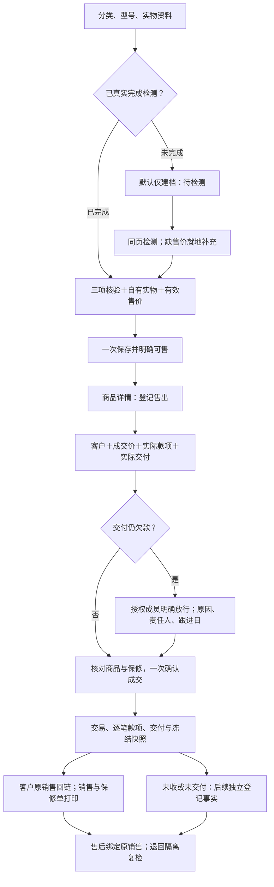

# 商品建档到成交的简化闭环

2026-10-06，按用户批准方案实施。商品列表直接打开同一份商品档案，不新增单机管理入口。

已完成检测且现场结清交付的常见路径，从六次独立保存减至两次：建档可售、确认成交。推进按钮为三次：建档提交、打开售出、成交提交。资料填写、真实检测及事实勾选另计，不以少步骤替代核对。

| 原问题 | 当前处理 |
| --- | --- |
| 三屏新建重复下一步，手机表单长 | 单页宽屏三组并排、中宽两列、手机单列；额外识码、问题随件、照片、规格、成本、来源按需展开 |
| 检测全勾仍须先保存再上架 | 一次保存检测并设为可售，部分检测可单独保存 |
| 正常检测强制重复说明 | 说明选填，空白保存三项结构化结果；暂停、复检仍要求原因 |
| 缺价需离开当前动作去更正 | 待检测就地补缺失／无效价；已有有效价仍走独立更正 |
| 已收款也被迫确认尚未收款 | 明确选择未收、全额、部分或多笔；同次逐笔实收 |
| 客户、付款、交付多次提交 | 同一成交表单一次事务；未收、未交付显式保留待办 |
| 恢复旧草稿冒充本次核验 | 保留资料，清除核验、所有权和成交事实确认 |
| 正式保存丢失检测说明 | 只发送业务备注；服务器生成操作者、时间、事件，原因保留原文 |
| 手机标题遮住聚焦价格 | 新建标题取消吸顶，保留16px输入与44px触控 |

复用现有后台事务、门店权限、版本、设置修订和幂等收据，不新增数据库表。付款、交付、欠款分别要求子权限；全部检查通过后才落库一次。未知成本不补零；成交冻结实物、买家、成本与保修。UUID请求派生销售／款项ID，不允许已有交易再次开账。照片沿用原处理限制，随建档保存；同型号新建不复制照片或核验。

保存成功才显示原打印入口，不自动打印。外部支付和消息不会由登记动作触发。

当前根370业务、3263三语键检查通过；正式本地13组API＋4组实际Chromium保存／刷新／恢复通过，涵盖回滚、权限、跨店、撤权、并发、幂等与冲突。合成门店／账号／故障触发器精确清理，生产业务写入0。以隔离发布候选最终结果补充；根目录其他登录设备修改不属于本轮发布。

证据：.local/retail-density/workflow-api.json、workflow-node.log、workflow-browser*.log。三语整机教程更新，3段新媒体完整验证，12段未变媒体哈希匹配并完整解码。

实体手机、相机扫码、物理打印、收款终端、真实弱网及跨物理设备未验；浏览器预览和API登记不能替代硬件验收。

最终根36双浏览器商品回归、最终宽屏10布局组通过；隔离候选364业务、3225三语键、TS、lint仅1既有warning、正式构建通过。新增顶层照片伪附到旧command严格拒绝且0写入，正式本地现为17组。宽屏三组并排，中宽两列、手机单列。
