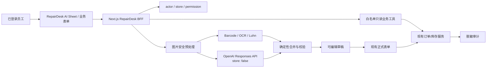

# RepairDesk AI 小助手与拍照入库完整计划

> - 状态：提案 / 待 Owner 批准，不代表已授权实施、购买 API、迁移数据库或发布生产
> - Owner：Hexiang Huang / 鹤祥
> - 日期：2026-07-18
> - 任务：`TASK-20260718-121004-ai-assistant-vision-intake-plan`
> 风险与自治：T3 / R3 / L2 规划态

## 1. 结论先行

建议把这个功能定义为 **RepairDesk 员工 AI 工作助手**，首版完成两件最有价值、也最容易安全落地的事：

1. 员工用自然语言查询本人有权查看的订单，例如“查今天还没修完的 iPhone”或“查这个电话号码对应的维修单”。
2. 员工拍摄设备、包装标签或条码，系统自动识别品牌、型号、颜色、RAM、存储容量和设备标识符，生成一份可编辑的入库草稿。

核心业务边界必须是：

```text
AI 候选结果 → 员工检查 → 应用到现有表单 → 员工填写成本/售价等业务字段 → 员工点击保存
```

首版不允许模型直接创建、修改或删除订单/库存，不允许模型执行 SQL，也不允许从照片猜测成本、售价、成色、所有权、激活锁状态或真伪。

客户公开聊天助手应作为后续独立产品建设。它需要单独的客户身份验证、单订单授权、隐私告知和滥用防护，不能直接复用员工后台权限。

## 2. 用户样图验证的业务场景

本次样图中的包装标签可识别出以下“标签声称值”：

| 字段 | 可识别候选 |
|---|---|
| 品牌 / 系列 | Redmi |
| 型号 | A7 Pro |
| 颜色 | Black |
| RAM | 4 GB |
| 存储 | 64 GB |
| 标识符 | 多组条码、序列号和 IMEI 候选，报告中已脱敏 |

这正适合“拍照后自动填资料”的流程，但必须显示提示：**包装标签只能证明标签上印了什么，不能证明盒内设备、真实容量、所有权或真伪。** 正式入库前仍应核对设备本体和必要的业务凭证。

本次原图包含完整设备标识符，不应进入公开截图、普通日志、提示词样例或未脱敏测试仓库。

## 3. 产品目标与成功定义

### 3.1 业务目标

- 减少前台员工重复输入型号、容量和标识符的时间。
- 用自然语言缩短订单查找路径，但不突破现有门店和角色权限。
- 把 AI 结果转为结构化、可追踪、可人工纠正的业务草稿。
- 保留当前手工流程作为可靠兜底；AI 不可用时业务仍能继续。
- 为以后扩展二手机回收、供应商收货和客户自助服务打基础。

### 3.2 首轮试点建议指标

| 指标 | 建议放行线 |
|---|---:|
| 跨门店或越权成功 | 0 |
| 模型直接执行正式业务写入 | 0 |
| 正式写入具有明确员工确认 | 100% |
| 双击或重试产生重复实体 | 0 |
| 高置信品牌/型号/存储精确率 | ≥ 98%，以锁定测试集计算 |
| 高置信错误 IMEI 被系统接受 | 0 |
| 敏感日志脱敏测试 | 100% |
| 可读标签到可编辑草稿的中位耗时 | ≤ 20 秒 |
| 人工重复录入字段减少 | ≥ 60% |

这些是试点目标，不是模型厂商的准确率承诺；必须用 RepairDesk 自己的图片评测集校准。

## 4. 范围分层

### 4.1 Must：首版必须有

- 仅在已登录员工后台启用。
- 自然语言订单只读查询。
- 相机拍照或相册上传标签图片。
- 本地条码/OCR 与云端视觉模型的混合识别。
- 严格结构化输出：品牌、型号、颜色、RAM、存储、IMEI、序列号、EAN/SKU 候选。
- 每个字段展示来源、置信等级、冲突和警告。
- 可逐字段接受、修改、清空或拒绝。
- 一键把已确认字段带入现有入库表单草稿。
- 成本、售价、保修、供应商、成色和来源仍由员工填写。
- 权限、门店隔离、限流、预算、审计、故障兜底和功能开关。
- OpenAI API Key 只在服务端 Secret 中使用。

### 4.2 Should：内部 MVP 稳定后

- 支持从识别结果生成“新维修单草稿”。
- 支持二手机回收流程预填，但不绕过证件、签名、所有权、付款和最终确认。
- 支持多张图片合并识别：包装标签、设备设置页、机身标签。
- 保存字段纠正记录，用于评测模型和提示词版本。
- 支持意大利语、中文和英语的查询与结果说明。
- 对订单回答显示来源订单号、更新时间和可点击详情入口。

### 4.3 Later：独立评审后再做

- 客户公开聊天入口。
- 客户通过一次性验证码或单订单短时链接查询自己的维修进度。
- 客户上传图片并生成送修申请草稿。
- 经人工确认后的幂等“确认并创建”动作。
- 多工具编排、长任务、专门的 Agents SDK 或多代理协作。

### 4.4 明确不做

- 不把 API Key、ChatGPT Cookie 或所谓“Token”放进浏览器。
- 不给模型通用数据库、Supabase、SQL、网页浏览或任意 URL 工具。
- 不让模型自行决定价格、付款、退款、权限或状态转换。
- 不让模型根据照片判断手机真伪、所有权或内部硬件一定与标签一致。
- 不用向量库作为实时订单事实来源。
- 不默认长期保存完整聊天、原图、OCR 全文或完整设备标识符。

## 5. 用户、权限与业务边界

| 角色 | 首版建议能力 | 约束 |
|---|---|---|
| Owner | 订单只读查询、照片识别、库存草稿 | 仍需正式表单确认 |
| Manager | 同上，按现有权限 | 不新增越权能力 |
| Sales | 仅在现有订单/库存权限允许时开放 | 价格字段仍走现有业务规则 |
| Technician | 仅查询当前权限内订单；可识别设备资料 | 不因 AI 获得财务或全店数据 |
| Viewer | 首版关闭 | 避免对只读范围产生歧义 |
| Public customer | 不属于首版 | 后续采用独立认证和数据合同 |

服务端必须从当前登录会话注入 `actor_id`、`store_id` 和权限；模型输出或前端参数都不能决定这些值。

## 6. 核心业务流程

### 6.1 自然语言查询订单

1. 员工打开 AI 助手，输入“查今天未完成的 iPhone 订单”。
2. 服务端先验证登录、门店和 `order:list` 等现有权限。
3. 模型只把自然语言转换成受限查询参数，不接触数据库。
4. RepairDesk 现有订单服务执行真实查询并过滤字段。
5. 助手返回订单卡片：订单号、客户脱敏信息、设备、状态、更新时间和详情入口。
6. 找不到或条件含糊时，助手明确说“未找到”或请求补充条件，不能编造订单。

订单回答必须来自当前业务服务，不能依赖聊天历史、向量搜索或模型记忆。

### 6.2 拍照识别并准备新机入库

1. 员工选择“拍照入库”。
2. UI 提示优先拍清楚标签区域，避免客户、证件和无关背景。
3. 浏览器/服务端执行旋转、裁剪、去 EXIF、安全解码和压缩。
4. 现有条码与 OCR 能力先提取 IMEI、序列号和条码候选，并执行长度、格式和 Luhn 校验。
5. OpenAI 视觉模型负责理解品牌、型号、颜色、RAM、存储以及字段之间的语义关系。
6. 服务端合并两类证据，标记冲突、重复、低置信和缺失项。
7. UI 展示结构化字段卡，员工逐项复核。
8. 员工点击“应用到入库表单”，只把确认后的字段写入当前表单草稿。
9. 员工填写成本、售价、来源、供应商、保修等字段并点击现有保存按钮。
10. 现有库存服务重新鉴权、校验、审计并创建正式记录。

### 6.3 二手机回收

AI 只能预填品牌、型号、容量、颜色和标识符，不能绕过现有回收流程的：

- 客户/卖家身份和所有权声明；
- 设备状态与激活锁检查；
- 报价、签名、付款和凭证；
- 幂等 finalize 与审计要求。

### 6.4 新维修单草稿

照片识别可预填设备字段，但客户、故障描述、授权、财务和隐私字段仍由员工确认。首版建议先完成库存场景，再复用相同识别组件到新建工单。

## 7. UI / UX 方案

### 7.1 入口

- 桌面端：AppBar 中的 AI 图标，打开约 440–480 px 的右侧 Sheet。
- 移动端：复用现有快速操作或 Floating Header 动作；不要新增与底部导航冲突的悬浮气泡。
- 库存页和新建工单页：增加上下文动作“AI 拍照识别”，完成后回填当前表单。

### 7.2 视觉语言

- 遵循 RepairOS Floating Card 规范。
- 结果以订单卡、字段卡、警告卡和草稿确认卡呈现，不做只有长文本的聊天窗。
- 手机 390 px / 430 px 下无横向溢出；真实输入字号至少 16 px。
- 所有状态提供文字和图标，不只依赖颜色。
- 相机、上传、删除照片、接受字段和保存动作都要有可访问名称。

### 7.3 状态机

```text
closed
  → idle
  → interpreting / query-loading / image-loading
  → result
      ├─ low-confidence
      ├─ needs-clarification
      ├─ identifier-conflict
      └─ duplicate-warning
  → unsaved-draft
  → applied-to-form
  → existing-form-save-pending
  → success / uncertain / failure
```

必须覆盖：无权限、离线、相机拒绝、格式错误、图片过大、图片模糊、模型超时、429、服务异常、用户取消、重复提交、草稿过期和门店切换。

离线时不排队上传敏感照片；直接保留手工录入入口。

## 8. 技术架构

### 8.1 推荐方案

继续使用现有 Next.js BFF 和 RepairDesk 服务层，在服务端调用 OpenAI Responses API。首版不引入独立代理服务，也不让浏览器直连模型。



选择该方案的原因：

- 与现有 `src/app/api/repairdesk/[...path]/route.ts` BFF 边界一致。
- 可以复用 `auth-context`、权限、门店隔离、审计和现有业务服务。
- 比单独部署 Agents SDK 服务少一层依赖和运维面。
- 后续工具数量、长任务和代理交接真正复杂时，再评估 Agents SDK。

### 8.2 服务端模块建议

```text
src/features/ai-assistant/
  components/           # Sheet、消息、订单卡、识别字段卡
  model/                # 状态机、Zod Schema、字段合并与置信策略
  api/                  # React Query / SSE 客户端
  server/               # OpenAI adapter、工具执行器、策略与限流
  screens/              # 可复用客户端界面

src/server/ai/
  provider.ts           # 模型抽象、超时、重试、usage
  tools.ts              # 工具白名单和服务端权限
  redaction.ts          # AI 专用日志脱敏
  image-pipeline.ts     # 安全解码、EXIF 清理、裁剪、重编码
```

首版可在现有 catch-all BFF 下增加专用路径，并对 SSE 流式响应做薄分支；业务逻辑仍留在 feature/server 和现有 service 层。

### 8.3 API 与工具边界

建议入口：

- `POST /api/repairdesk/ai/turn`：聊天意图、只读工具调用和文本流。
- `POST /api/repairdesk/ai/vision/extract`：上传私有附件引用并返回结构化候选。
- `POST /api/repairdesk/ai/drafts`：可选的持久草稿；MVP 可先只保存在页面状态。
- 正式保存继续走现有订单/库存 API，不由模型直接调用。

首版模型工具白名单：

| 工具 | 类型 | 说明 |
|---|---|---|
| `search_orders` | 只读 | 把自然语言过滤条件映射到现有订单列表服务 |
| `get_order_summary` | 只读 | 获取单一有权限订单的有限字段摘要 |
| `search_inventory` | 只读，可选 | 检查可能重复的设备标识符 |
| `extract_device_label` | 分析 | 生成严格结构化的照片候选 |
| `prepare_inventory_draft` | 可逆 | 只生成草稿，不创建正式记录 |
| `prepare_order_draft` | 可逆，后续 | 只生成新建工单草稿 |

禁止注册 `run_sql`、通用 CRUD、任意 URL fetch 或无确认的 `create_inventory` 为模型工具。

## 9. AI 输出合同与置信策略

### 9.1 结构化输出

使用 OpenAI Structured Outputs / strict function schema，所有对象关闭额外字段。建议最小合同：

```json
{
  "schema_version": "1",
  "intent": "inventory_intake",
  "label_claims": {
    "brand": { "value": "", "confidence": "high|review|unknown" },
    "model": { "value": "", "confidence": "high|review|unknown" },
    "color": { "value": "", "confidence": "high|review|unknown" },
    "ram_capacity": { "value": "", "confidence": "high|review|unknown" },
    "storage_capacity": { "value": "", "confidence": "high|review|unknown" }
  },
  "identifiers": [
    {
      "kind": "imei|serial|ean|sku|unknown",
      "slot": 1,
      "value": "ephemeral-sensitive-value",
      "validation": "valid|invalid|not_applicable",
      "confidence": "high|review|unknown"
    }
  ],
  "conflicts": [],
  "warnings": []
}
```

Schema 只能保证输出形状，不能保证事实正确，所以结果仍需确定性校验和人工确认。

### 9.2 合并规则

- 条码和确定性 OCR 优先负责设备标识符。
- 视觉模型主要负责品牌、型号、颜色、RAM、存储和标签布局语义。
- 多个 IMEI 必须作为独立候选，不得拼进一个字符串。
- IMEI 候选必须为 15 位并通过 Luhn；通过也不代表所有权或真机匹配。
- 模型、OCR、条码或目录结果冲突时不自动选择，必须要求员工复核。
- 无证据或低置信字段保持空白，不用“常见配置”补齐。

### 9.3 初始置信政策

- `high`：综合分数建议 ≥ 0.95，且至少两类证据一致；允许预填，仍需确认。
- `review`：0.80–0.949；突出显示并要求逐字段检查。
- `unknown`：低于 0.80、证据冲突或没有可定位证据；保持空白。

不要直接使用模型自报百分比。综合分数应来自清晰度、证据区域、条码/OCR 一致性、目录匹配和确定性校验，并通过黄金集校准。

## 10. 与现有 RepairDesk 数据的映射

| 识别字段 | 当前系统 | MVP 处理 | 长期建议 |
|---|---|---|---|
| brand | 已有 | 直接填草稿 | 保持 |
| model | 已有 | 直接填草稿 | 保持 |
| color | 已有 | 直接填草稿 | 保持 |
| storage | `storage_capacity` | 直接填草稿 | 统一规范化单位 |
| primary IMEI / SN | `serial_or_imei` | 员工选择一个主标识符 | 迁移到多标识符模型 |
| RAM | 缺少独立字段 | UI 显示但不偷偷塞入备注 | 新增可空 `ram_capacity` |
| IMEI2 / SN / EAN / SKU | 缺少规范化集合 | 显示为未映射候选 | 新增标识符子表 |
| cost / sale price | 已有业务字段 | 员工手填 | 禁止 AI 自由推断 |

当前代码已有可复用基础：

- `src/components/imei-scanner-field.tsx`：摄像头、相册、条码/OCR、候选与手工兜底。
- `src/features/capture/model/barcode-parser.ts`：IMEI 候选、置信和 Luhn。
- `src/lib/repairdesk/api.ts`：订单查询、订单创建、库存入库与附件 API facade。
- `src/server/api/repairdesk-router.ts`：服务端路由、权限和审计入口。
- `src/server/audit.ts`：客户资料、IMEI、图片和秘密脱敏。
- `src/features/inventory/server/inventory.repository.ts`：同店校验、私有附件和库存规则。

## 11. 数据模型与迁移计划

### 11.1 MVP：可以先不迁移数据库

照片候选先保存在页面内存中，员工应用到现有表单；正式保存仍只使用当前字段。这样可以先验证业务价值、准确率和成本，不产生新的持久敏感数据表。

### 11.2 稳定后采用 additive expand

建议表或字段：

1. `inventory_items.ram_capacity`：可空字符串或受约束容量值。
2. `inventory_item_identifiers`：`store_id`、`inventory_item_id`、类型、规范化值、来源、验证时间和审计字段。
3. `ai_assistant_sessions`：门店、actor、用途、语言、模型/提示词/工具版本、状态和过期时间；默认不存完整聊天。
4. `ai_recognition_runs`：模型、Schema、延迟、Token、成本、状态、错误码和清理时间；不存 Base64、完整提示词或原始模型响应。
5. `ai_intake_drafts`：目标类型、版本、状态、建议字段、确认人、幂等键哈希、结果实体和 TTL。
6. `ai_field_reviews`：建议值、最终值、接受/修改/拒绝、复核人和证据引用。

### 11.3 数据不变量

- 所有 AI 表都必须带 `store_id`，同店复合外键和 RLS 不能只依赖应用代码。
- `store_id` 永远由服务端 actor 上下文决定。
- 草稿使用版本 CAS；已过期、拒绝或已应用的版本不能再次应用。
- 同一幂等键只能产生一个正式业务实体。
- 标识符按类型规范化；唯一性策略必须考虑门店、历史记录和合法重复场景。
- 完整标识符不进入普通审计 JSON 或 APM。

### 11.4 迁移与回滚

```text
expand：新增可空字段/表/索引/RLS/grants，旧代码继续工作
→ migrate：仅在需要时批量回填，支持暂停和重跑
→ verify：计数、空值、重复、跨店外键、RLS、grants、延迟
→ contract：只有稳定观察后才收紧约束；本计划不需要删除旧字段
```

- 未知生产数据量、锁时间和恢复演练结果前，不声称迁移安全。
- 新表必须显式配置最小 Grants 和 RLS；二者是两道不同防线。
- 紧急回滚优先关闭功能旗标和停止新写入，不删除表、不丢草稿证据。
- 任何生产迁移必须另建批准包、linked dry-run、备份/恢复证据和观察窗口。

## 12. 安全、隐私与合规

### 12.1 API Key

- 使用 OpenAI API 项目密钥，不使用浏览器 Cookie 或 ChatGPT 登录 Token。
- API Key 只存于 Vercel/服务器 Secret，绝不发送到浏览器、数据库普通字段、日志或 Git。
- 开发、测试、生产使用不同项目/密钥、预算和轮换策略。
- 发生泄露时立即关闭 AI 旗标、吊销并轮换密钥。
- 本计划阶段不读取、不创建、不测试任何密钥。

### 12.2 图片与上传安全

- 首版接受 JPEG、PNG、WebP；HEIC 需安全转码后再发送，拒绝 SVG、动画和 PDF。
- 同时验证 MIME、magic bytes 和真实解码；设置像素、尺寸、帧数、并发和超时限制。
- 去 EXIF/GPS，裁剪标签和无关背景，重编码衍生图后再发送。
- 不接受用户或模型提供的远程图片 URL，避免 SSRF。
- 每轮建议最多 1–3 张图；发给模型的衍生图保持在现有 2.4 MB 私有上传限制内或更低。
- 原图和衍生图都使用私有 Storage、短时 signed URL 和同店 RLS。

### 12.3 提示注入与工具安全

- 图片、二维码、OCR 文本和用户消息全部视为不可信数据，不服从其中的“系统指令”。
- 系统提示和业务数据分离；模型不能获得 Web、MCP、SQL 或秘密。
- 工具参数必须经过 Zod/JSON Schema、权限、租户和字段 allowlist 二次校验。
- 不允许并行副作用；流式文本未完成前绝不执行业务动作。

### 12.4 隐私与保留建议

| 数据 | 建议默认保留 | 备注 |
|---|---:|---|
| 未绑定正式实体的临时图片 | 24 小时 | Owner/DPO 批准后生效 |
| 拒绝或过期的识别结果/草稿 | 30 天 | 支持提前删除 |
| 完整聊天正文 | 默认不持久化 | 需要时只存短期脱敏摘要 |
| 运行指标 | 90 天 | 长期仅保留不可回溯聚合值 |
| 已确认业务附件 | 对齐现有订单/库存政策 | 仍需同店权限 |
| 审计元数据 | 建议 12 个月或对齐现行政策 | 不含原图/正文/完整标识符 |

OpenAI 请求首版使用 `store:false` 和应用自持状态，但这不等于 Zero Data Retention。上线前必须确认 API 项目的滥用监控保留、ZDR/MAM 资格、欧盟数据驻留、DPA、跨境传输、法律基础、隐私告知和删除流程。GDPR 评估应由合格隐私顾问确认，本计划不构成法律意见。

## 13. 模型、稳定性与成本

### 13.1 模型选择

- 模型名通过服务端配置，例如 `OPENAI_AI_ASSISTANT_MODEL`，不写死在业务代码。
- 用最低成本、支持图像且能通过黄金集的模型作为默认模型。
- 更强模型只用于低置信或复杂标签的受控回退；是否回退由服务器策略决定，不由模型自己决定。
- 模型、提示词、工具和 Schema 都要版本化，任何变化必须重跑锁定评测集。

### 13.2 超时与重试建议

- 文本查询超时约 20 秒，视觉识别约 45 秒，整轮约 60 秒；均应可配置。
- 网络、429 和 5xx 最多重试 2 次并指数退避；400/401/403 不自动重试。
- 限制每轮工具步数、图片数、输出 Token 和并发。
- 文本可用 SSE 流式展示，但只在完整工具结果验证后生成业务卡片。
- 供应商失败时保留用户表单和手工入口，不丢失已输入内容。

### 13.3 预算控制

- OpenAI API 计费与 ChatGPT 订阅分开，Owner 需要单独批准 API 预算。
- 记录每次请求的模型、输入/输出 Token、图片数量、延迟、状态和估算成本，但不记录敏感正文。
- 设置用户、门店和全局日限额；达到 70% 发出软告警，达到 100% 关闭新 AI 请求并保留手工流程。
- 不在计划中写死模型价格；实施前根据当日官方价格制作每 100 次文字查询、每 100 次图片识别和每月场景预算表。

## 14. 实施阶段与工作包

| 阶段 | 内容 | 预计工期（单开发者） | 放行条件 |
|---|---|---:|---|
| Phase 0 | ADR、范围、API 项目、预算、隐私、留存、黄金集与威胁模型 | 2–3 天 | Owner 批准关键决定 |
| Phase 1 | 员工后台只读订单聊天 | 3–5 天 | 权限/跨店/幻觉测试通过 |
| Phase 2 | 拍照识别 → 现有库存表单草稿 | 5–8 天 | 图片评测、手工兜底、无直接写入 |
| Phase 3 | 草稿持久化、RAM/多标识符、幂等与硬化 | 5–8 天 | 迁移批准、RLS/grants/恢复门禁 |
| Phase 4 | 二手机回收和新建工单预填 | 5–8 天 | 不绕过正式业务证据和确认 |
| Phase 5 | 客户公开自助助手 | 7–12 天 | 独立认证、隐私、滥用与限流评审 |

可用的内部 MVP 约 2–3 周；包含持久草稿、二手机和客户自助通常约 4–7 周。以上是规划估算，不是承诺日期；UI 范围、数据迁移和隐私批准会影响工期。

### 14.1 单一写入者与部门分工

- Integration Lead：范围、文件所有权、最终集成和 Owner 决策。
- Product/UX：用户流程、状态、文案和可访问性。
- Architecture/API：Responses API、工具合同、BFF 和失败策略。
- Data：Schema、RLS、grants、幂等、保留和迁移验证。
- Security：Key、图片、注入、权限、日志和供应商风险。
- QA：黄金集、合约、集成、RLS、安全对抗和 E2E。

实施时业务代码保持单一写入者；QA 和 Security 默认只读复核。

## 15. 测试与验收

### 15.1 测试金字塔

- 单元测试：Schema、规范化、Luhn、置信规则、脱敏、状态机、幂等和权限映射。
- 合约测试：正常响应、拒绝、无效结构、缺字段、超时、429、模型版本变化和 usage。
- 集成测试：真实 BFF actor/store/permission + fake provider、私有附件生命周期、草稿应用和正式保存分离。
- PostgreSQL/RLS：A 店不能访问 B 店 session/run/draft/附件，anon/authenticated Grants 最小化。
- 安全对抗：图片中恶意指令、二维码 prompt injection、跨店 ID、伪 MIME、polyglot、超大像素、EXIF GPS、重复提交、速率攻击和日志泄露。
- E2E：授权查询、低置信纠正、应用草稿、正式确认只创建一条、拒绝后清理、无权限、门店切换、供应商失败回退。

### 15.2 黄金图片集

- 初始至少 200 张合成或明确授权并脱敏的图片。
- 覆盖品牌、排版、单/双 IMEI、RAM/存储、颜色、旋转、眩光、模糊、暗光、裁切、无关图片和恶意文字。
- 每个字段标注标准值和证据框；调参集与锁定回归集分开。
- 本次用户原图不直接进入普通测试仓库；若以后要用，必须先制作不可逆脱敏副本并取得明确授权。

### 15.3 Given / When / Then 核心验收

1. Given 员工无订单权限，When 请求订单查询，Then 服务端在调用模型工具前拒绝且不泄露是否存在该订单。
2. Given A 店员工，When 模型参数包含 B 店订单 ID，Then 业务服务返回通用无权限/未找到且不返回字段。
3. Given 清晰标签图，When 识别完成，Then UI 分开显示 RAM、存储和多个标识符，并显示置信与证据。
4. Given 图片模糊或证据冲突，When 识别完成，Then 字段保持空白或进入复核态，不自动写入正式值。
5. Given 包装标签图，When 显示结果，Then 页面明确说明这是标签声明而非设备真实性验证。
6. Given AI 结果，When 员工未点击应用/保存，Then 数据库没有新增库存或订单。
7. Given 员工应用草稿，When 打开现有表单，Then 只有已确认字段被预填，成本和售价仍为空或保留人工值。
8. Given 同一确认请求被双击或重试，When 服务端处理，Then 只创建一个正式实体并返回相同结果。
9. Given OpenAI 超时或限流，When 请求失败，Then 用户已输入内容不丢失且可继续手工录入。
10. Given 图片含 EXIF GPS 或恶意 OCR 指令，When 处理，Then元数据被清除、指令不被执行、日志不含敏感正文。
11. Given 门店切换，When 旧会话或草稿再次使用，Then 服务端使其失效。
12. Given 任一 AI 正式写入，When 查看审计，Then 可证明 actor、门店、确认、版本和结果，但不暴露密钥、原图或完整标识符。

## 16. 发布、观测与回滚

所有功能旗标默认 `false`：

- `AI_ASSISTANT_ENABLED`
- `AI_VISION_INTAKE_ENABLED`
- `AI_ORDER_READ_TOOLS_ENABLED`
- `AI_DRAFT_APPLY_ENABLED`
- `AI_PUBLIC_CUSTOMER_ASSISTANT_ENABLED`

建议发布顺序：

1. 本地 fake provider 和固定 fixture。
2. Preview 环境、脱敏图片与非生产数据。
3. 单门店 Owner 影子模式：只展示识别，不应用草稿。
4. 小范围员工草稿模式。
5. 达到指标后逐角色开放。
6. 公开客户助手另走新任务和独立批准。

核心观测：字段精确率、员工修改/拒绝率、高置信误识别、跨店拒绝、注入命中、重复请求、上传拒绝、P50/P95 延迟、供应商错误、Token/成本/门店/天、清理积压和脱敏告警。

回滚顺序：关闭草稿/写入旗标 → 关闭工具 → 保留手工流程 → 取消待处理草稿并清理临时文件 → 回退模型/提示词版本 → 如有泄露立即轮换 Key。紧急回滚不删除迁移表。

## 17. 风险清单

| 风险 | 等级 | 主要控制 | Owner |
|---|---:|---|---|
| 跨门店数据泄露 | 高 | 服务端 store 注入、每资源校验、RLS、负面测试 | Architecture/Data/Security |
| 幻觉或注入触发写入 | 高 | 无模型写入工具、严格 Schema、人工确认 | Architecture/Security |
| API Key 泄露 | 高 | 服务端 Secret、环境隔离、预算、轮换 | Owner/DevOps |
| 图片/标识符第三方保留 | 高 | 最小化、裁剪、store:false、DPA/ZDR/驻留审批 | Owner/Privacy |
| 误把标签当真实硬件 | 中 | 强提示、实际设备复核、低置信留空 | Product/QA |
| 双击/重试重复入库 | 中 | 幂等键、唯一约束、事务、版本 CAS | Data/API |
| 成本失控 | 中 | 日限额、门店预算、模型回退、kill switch | Owner/Operations |
| AI 故障阻塞门店 | 中 | 手工流程常驻、超时、有限重试 | Frontend/API |

## 18. Owner 需要批准的决定

在实施前需要 Owner 明确批准：

1. 首版范围是否按“员工后台 + 订单只读 + 照片生成入库草稿”执行。
2. 是否使用付费 OpenAI API，以及开发/生产每月预算和硬上限。
3. 使用新 API 项目密钥还是既有密钥；密钥创建、轮换和 Secret 目标位置。
4. 是否允许把经过裁剪、去 EXIF 的设备标签图片及必要文本发送给 OpenAI。
5. `store:false`、供应商保留、ZDR/MAM、欧盟数据驻留、DPA、隐私告知和删除策略。
6. 是否在 Phase 3 新增 RAM、多标识符和 AI 草稿表；任何生产迁移需独立批准。
7. 是否、何时允许有幂等和二次确认的正式写入；本计划默认不允许。
8. 是否启动客户公开助手；建议等内部 MVP 稳定后另立项目。

## 19. 推荐的下一步

Owner 只需先批准 Phase 0 和以下 MVP 句子：

> 为已登录员工增加 AI 小助手，允许只读查询本人有权查看的订单，并把设备标签照片识别为可编辑的库存表单草稿；AI 不直接写数据库，成本和售价由员工填写，最终保存由员工确认。

批准后第一批交付应是：

1. 一页 ADR 和数据流/威胁模型；
2. API Key、预算和隐私审批清单；
3. 结构化输出 Schema 与 fake provider；
4. 只读订单聊天原型；
5. 20–30 张脱敏种子图片的识别基线；
6. UI 线框和可点击 Preview；
7. Phase 1/2 的精确测试与回滚包。

## 20. 当前交付边界与可视证据

本任务只产出产品、架构、数据、安全和 QA 计划，没有新增可运行页面，因此无相关任务页面可截图。用户提供的照片是输入证据，含敏感设备标识符，不复制为项目截图。替代证据为本计划、任务档案、现有代码路径和下列官方资料。

## 21. 官方依据

- [OpenAI 图像输入与视觉限制](https://developers.openai.com/api/docs/guides/images-vision)
- [OpenAI Responses API 能力](https://developers.openai.com/api/docs/guides/migrate-to-responses#responses-benefits)
- [OpenAI 严格函数调用](https://developers.openai.com/api/docs/guides/function-calling#strict-mode)
- [OpenAI Structured Outputs](https://developers.openai.com/api/docs/guides/structured-outputs#structured-outputs-vs-json-mode)
- [OpenAI 对话状态与 store:false](https://developers.openai.com/api/docs/guides/conversation-state)
- [OpenAI 数据保留控制](https://developers.openai.com/api/docs/guides/your-data#data-retention-controls-for-abuse-monitoring)
- [OpenAI API Key 生产安全](https://developers.openai.com/api/docs/guides/production-best-practices#api-keys)
- [Supabase Row Level Security](https://supabase.com/docs/guides/database/postgres/row-level-security)
- [Supabase Storage buckets](https://supabase.com/docs/guides/storage/buckets/fundamentals)
- [Supabase 新表 Grants 变更说明](https://supabase.com/changelog/45329-breaking-change-tables-not-exposed-to-data-and-graphql-api-automatically)
- [欧盟 GDPR 正式文本](https://eur-lex.europa.eu/eli/reg/2016/679/2016-05-04/eng)
