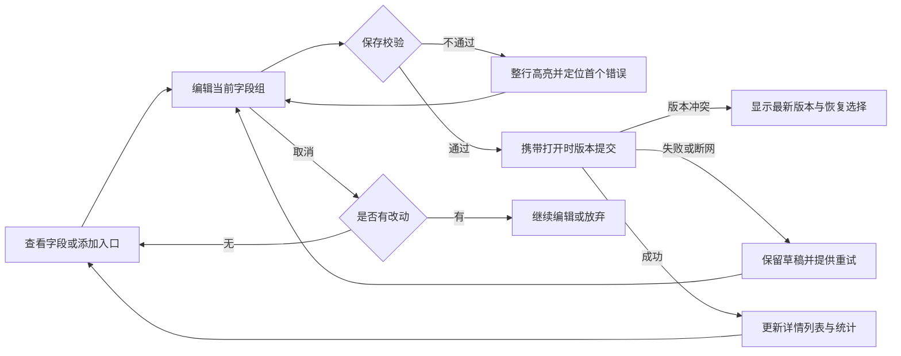

# RepairDesk 维修工单编辑闭环与紧凑弹窗：合并执行计划

日期：2026-09-17。代码审计基线：`762132d151bb8aa9b40a9a0c78955caa23fc331a`。

**当前状态：2026-09-17 已按老板明确指令进入实施，直接编辑、客户版本保护和紧凑弹窗候选已实现；正在执行最终验收与发布门禁。** 本文合并“桌面弹窗减少留白”和“订单详情直接编辑”两份方案，是本批唯一执行计划。历史重构进度继续见[总报告](EXPERIENCE_REFACTOR_AUDIT_2026-09-15.md)。

## 1. 最终要达到的效果

1. 打开工单详情后，点击相应字段即可编辑；空字段显示明确的“添加”入口，不需要先点“更多 → 编辑”。
2. 客户姓名、主号、备用号、设备、手机解锁密码、故障、诊断、备注、随附物品、保修都有完整的查看、添加、修改、取消和保存路径。
3. 报价卡直接编辑项目及金额；相关金额属于同一份草稿、一次保存。总额、已收和尾款继续作为计算或账务结果。
4. 备忘录、独立报价编辑等短任务采用内容自然撑高的紧凑窗口；复杂工单工作台保留独立布局。
5. 从列表进入、创建、编辑、检测报价、审批、维修、通知、收款、交付到历史查询，建立可验证的正常、失败和恢复流程。
6. 电脑、iPad、手机使用相同业务能力和保存规则，布局按设备调整。

“直接编辑”不意味着所有字段都可任意改：工单编号、审计记录、计算金额仍只读；终态纠正、状态流转、正式报价发布和收款继续使用专用业务动作。既有权限不扩大。

## 2. 本次已经核实的事实

证据等级：**代码确认**表示当前执行路径可见；**用户报告**表示来自截图或描述；**待复现**表示尚未取得当前运行环境的交互证据。

| 编号 | 发现与证据 | 执行动作 | 优先级 |
|---|---|---|---|
| E01 | 代码确认：`styles.css:1887` 的 `task-workspace` 在768px以上强制近全屏宽高；覆盖备忘原576px尺寸。截图出现大量空白 | 短任务按调用方退出全屏样式；自然高度、受限宽度、超长正文滚动 | P1 |
| E02 | 代码确认：桌面手机号使用 `PhoneContactMenu`，联系菜单没有修改动作；备用号为空不渲染 | 主号整行可编辑；空主号/备用号均有添加入口；联系功能使用独立按钮 | P1 |
| E03 | 代码确认：桌面密码使用 `DeviceUnlockViewer`，无值仅占位；手机已有独立密码编辑按钮 | 接入同一密码编辑能力；分别处理未提供、无需密码、有密码及不可读状态 | P1 |
| E04 | 代码确认：`order-identity-editor.tsx:100` 要求姓名和电话同时非空；创建流程允许空姓名 | 按实际修改字段校验；匿名客户可只补电话，不强迫填写无关姓名 | P1 |
| E05 | 代码确认：`buildEditForm` 优先客户主档；部分显示优先工单快照；PATCH更新客户主档。具体保存后不一致尚待运行复现 | 明确本单联系方式、客户档案、历史快照的责任；验证读、写、搜索、通知使用一致来源 | P1，数据专项 |
| E06 | 用户报告：更多菜单点击“编辑”后页面错误；当前未获得异常栈或可靠复现，不能认定根因 | 用真实详情组件复现页面和弹窗两条入口，捕获脱敏异常；在字段覆盖完成后移除总编辑入口和重复状态 | P1 |
| E07 | 代码确认：已有局部编辑与整体编辑并存，诊断在整体编辑中仍有可编辑路径；测试存在旧总编辑入口选择器 | 建立字段覆盖矩阵；补诊断等局部入口；更新实际交互测试，不能只删按钮 | P1 |
| E08 | 代码确认：报价已有 `FinanceInlineEditor`，直接入口仍打开独立弹窗 | 详情报价卡复用表单原位编辑，保留其他场景独立紧凑报价窗口 | P1 |
| E09 | 代码确认：全局和局部编辑分别持有状态，部分局部保存共用会清空全局草稿的成功回调；具体丢草稿组合尚待复现 | 局部保存只结束自身会话；消除重复草稿及跨组清理副作用；加入切换组与并发测试 | P1 |

规划阶段基线（非本批实施结果）：主线程10文件159项通过；独立路径审计3文件21项通过，共13文件180项。覆盖编辑计划、差异、金额、支付、状态流、保管、局部编辑器、订单仓库、查询与部分真实展示组件。**不等于全功能验收，也不证明E06已修复。** 当时尚未运行线上写入或三端完整浏览器测试。实施后的真实证据见第12节及总报告第18节。

## 3. 统一编辑交互

### 3.1 字段覆盖与保存边界

| 区域/字段 | 直接入口 | 保存与验证要求 |
|---|---|---|
| 客户姓名 | 点击姓名；无值显示“添加姓名” | 只校验实际修改字段；保留匿名客户业务语义 |
| 主手机号、备用号 | 点击号码行编辑；无值仍显示添加入口 | 同组保存；国家区号、格式、去重、冲突提示；不能暗中更换 `customer_id` |
| 联系客户 | 号码旁独立联系按钮 | 拨号、复制、消息入口与编辑目标分开；本批不自动外发客户消息 |
| 品牌、型号 | 点击对应值进入设备组 | 复用品牌/型号/代码联想；品牌改变时仅处理不兼容型号，不清除无关草稿 |
| IMEI / SN | 点击值或添加编号；扫码独立按钮 | IMEI与SN含义明确；只有有效15位IMEI触发识别；无效输入原位提示 |
| 手机密码 | 明确“添加密码 / 修改密码” | 与显示/隐藏分开；保留读取与写入权限、解锁类型、版本及保管规则 |
| 随附物品 | 点击整行 | 支持多选；“无”与未填写有区别；一次保存 |
| 故障描述 | 点击描述或添加入口 | 独立保存，不混写设备外观备注或诊断 |
| 诊断结果 | 点击诊断区域进入现有诊断编辑 | 保留现有维修权限和诊断命令；不得因移除整体编辑而失去修改能力；不自动发布正式报价 |
| 设备备注、内部标签 | 点击值或添加入口 | 显式保存，长内容可读，内部字段按权限展示 |
| 保修 | 点击当前保修 | 时长和必要变更原因同组提交，历史审计语义保留 |
| 报价项目、单价、定金 | 直接点击报价卡的行或金额 | 同一报价草稿，统一保存/取消，行ID稳定；不能逐字段分别写入 |
| 总额、已收、尾款 | 只读汇总 | 不当作普通输入；收款、退款、冲销沿用专用路径 |
| 负责人、供应商 | 负责人保留原有专用派单入口；供应商按权限直接选择 | 不把创建人/录入人等审计身份做成普通字段；复用服务端能力；实际写入成功后关闭，失败保留当前选择 |
| 状态、保管、交付、取消 | 专用操作入口 | 只列出合法动作，显示前置条件/原因，成功后反映真实状态 |
| 工单编号、创建时间、历史记录 | 只读 | 不通过通用字段编辑器修改 |

### 3.2 草稿状态与错误恢复

- 优先一次编辑一个关联小组。切换组时有未保存内容，提供继续、保存、放弃；同一字段不能同时属于两份编辑草稿。
- 不采用失焦自动保存；点击外部、Escape、关闭详情、切换订单均经过既有脏草稿保护。
- 后台刷新、切换窗口、旋转设备不得覆盖输入。成功保存后使用服务器返回的新版本开启下一次编辑。
- 保存中防止重复提交；请求结果不确定时遵守现有幂等/回执协议，不能生成新业务动作盲目重试。
- 错误在相应字段附近显示，保留输入；提交失败不关闭，不使用“已保存”提示。
- 报价草稿不参与正式发布、审批、通知或收款；这些操作先要求解决未保存改动。
- 密码默认隐藏；编辑明文仅保留当前内存会话，取消或结束时清除，不进入日志、URL、浏览器持久存储和测试截图。
- `sensitive_redacted`（服务端已脱敏）必须显示受限状态，不能误认成“尚未填写”并显示添加入口；查看和修改分别按实际权限判断。

## 4. 手机号与报价的数据闭环

### 手机号

执行前以合成客户建立“同一客户两张工单”的复现，逐项比较客户主档、本单快照、详情、列表、搜索和通知收件人。必须解决：改动到底属于本单联系方式还是客户档案，以及保存后的显示来源。

建议采用明确的操作含义：本单号码修改与客户档案同步必须有清楚范围；不静默批量修改历史工单快照，不自动换客户。先尽量复用现有API；只有数据模型确实缺少表达能力时才提出最小兼容迁移及回滚方案。本项结论未落实前，不宣称“电话修改已闭环”。

### 报价与账务

- 复用现有 `FinanceInlineEditor`、字符串金额草稿、稳定行ID、金额规范化及版本化提交。
- 空金额不能误变为0；明确填写0应保留。校验负数、非法小数、定金超过报价、已有收款后调价及删除所有项目。
- 将“编辑报价草稿”“发布正式报价”“客户审批”“实际收款”视为不同动作，保留独立权限。
- 当前组合保存已有一次版本化PATCH路径，不能因UI重构退回多个无事务的请求。
- 单项保存不覆盖别的字段；关联金额一次提交。服务端仍校验权限、门店、版本、状态和账务规则。

## 5. 合并后的弹窗与三端布局方案

| 场景 | 桌面/iPad目标 | 手机目标 |
|---|---|---|
| 新建备忘 | 宽度上限576px；自然高度，收起详情约300–380px参考；展开后增长 | 保留现有底部编辑表面与安全区 |
| 独立报价编辑 | 宽度上限860px；少量项目约460–560px参考；仅设置最大高度 | 保留整组报价编辑与触控操作 |
| 详情内报价 | 在原报价卡内展开；保存紧接金额组 | 按可用空间使用原卡或现有紧凑表面，共享同一草稿 |
| 单字段/小组 | 原行或原卡编辑，关联选择使用小型选择器 | 点击字段直接进入对应编辑表面，返回原位置 |
| 复杂任务工作台 | 按内容复杂度保留宽布局 | 独立适配，不机械缩放桌面 |

共同规则：

- 不为短任务设置全屏高度或大 `min-height`；使用视口安全的最大高度。短内容的按钮跟随正文，长内容时正文滚动且按钮可达。
- 去掉报价重复标题，标题/内容/页脚左右对齐；控制组之间有清楚但紧凑的间距。
- 保留维修类别既有4列×3行约定，型号和规格选择器必须能滚动到末项。
- 详情已处于弹窗时，局部编辑优先在同卡展开或同一模态表面切换，避免再叠一个全屏弹窗。
- 主正文与内层选择器滚动职责清楚；内层Escape先关闭选项，不能误关整个工单。
- iPad保留外侧边距、横竖屏可达和触控尺寸；手机输入字号及底部安全区沿用现有规范。
- 共18处组件使用 `taskWorkspace`：按调用方分类调整，不能直接全局删除。
- 继续复用现有组件和样式token；同步修正短编辑与全屏工作区的规范冲突。

## 6. 维修工单完整操作核查矩阵

以下均为实施后的验收任务；现有测试通过不能直接将这些行标为通过。

| 流程 | 正常路径 | 必须覆盖的异常/闭环 |
|---|---|---|
| 列表与队列 | 搜索、筛选、列表/卡片/状态板、100条递增加载、下拉刷新 | 筛选重置、去重、加载失败重试、返回后位置、统计一致 |
| 新建工单 | 客户查找/新建、设备联想、必填定位、提交后进入详情 | 重复客户/电话、空姓名、草稿恢复、重复提交、断网结果不确定 |
| 详情入口 | 列表弹窗、详情URL、二维码进入同一订单 | 无权限、失效ID、加载失败、返回定位、不能白屏 |
| 资料编辑 | 本文所有字段有值修改、空值添加、清除 | 校验、取消、失败重试、刷新重开、没有跨字段误写 |
| 报价与审批 | 添加/改价/删除→保存→发布→审批 | 过期报价、拒绝、重新报价、审批中改价、草稿不得送出 |
| 维修与配件 | 检测、诊断、负责人、供应商、待配件/到件/维修 | 非法跳转、配件未到、返工、外修、失败及重试 |
| 通知 | 准备正确收件人和内容→人工确认动作 | 修改手机号后的收件人、过期报价、重复记录、发送失败与版本冲突 |
| 收款与交付 | 定金/尾款、付款状态、保管状态、交付 | 重复收款、收款后调价、余额未清、取消后不可收款、交付前置条件 |
| 取消/终态 | 取消原因、未修取回、重新打开、纠正记录 | 设备仍在店内、已有账务、作废只读、历史记录保留 |
| 图片/签名/扫码 | 上传、查看、扫码识别、签名入口 | 无相机权限、上传失败重试、错误二维码、无附件权限 |
| 打印与分享 | 正确订单/金额/编号的预览与打印、复制链接 | 资源未就绪、弹窗被拦、打印失败重试；二维码重置须明确影响旧码 |
| 并发与跨设备 | A保存，B看到新值；列表/详情/统计同步 | B旧草稿冲突、不静默覆盖、切换门店清缓存、断网恢复 |
| 历史与审计 | 保存后可查谁修改了什么及状态历史 | 不产生重复事件，不泄露密码，不将客户快照误写成全历史更新 |

角色协作验收：前台接单 → 技师处理有权访问的订单并录入诊断 → 有报价权限的员工发布 → 前台通知/收款/交付 → 老板查看历史。拒绝报价、待配件、取消返还、返工及并发冲突各走一条分支。外发消息和真实支付用隔离测试或人工触发验证，不操作真实客户资金与消息。

## 7. 权限矩阵：沿用当前服务端能力

| 动作 | 老板/店长 | 前台销售 | 技师 |
|---|---|---|---|
| 接待资料 | 在当前门店且工单状态允许时 | 当前门店允许范围 | 仅分配/授权范围 |
| 维修资料、诊断 | 允许范围 | 现有scoped范围 | 仅分配/授权范围 |
| 准备正式报价 | 现有权限允许 | 当前默认允许 | 当前默认不允许 |
| 直接调整财务 | 当前默认允许 | 当前默认不允许 | 当前默认不允许 |
| 收款 | 当前默认允许 | 当前默认允许 | 当前默认不允许 |
| 读取手机密码 | `unlock:read`及详情投影约束 | 当前权限和脱敏约束 | 仅授权订单范围 |
| 终态纠正/重新打开 | 审计入口与权限允许时 | 当前默认不允许 | 当前默认不允许 |

以运行时 `capabilities`、权限、门店和状态为准，不能只按角色名称硬编码。任何只读角色/无门店/跨门店请求均须服务端拒绝；已作废记录不因新增字段按钮重新变成可编辑。没有调整财务权限的前台，应能理解“准备报价”和“修改已记录金额”的不同入口与限制。

## 8. 分阶段执行顺序、影响文件与退出条件

| 阶段 | 执行动作 | 主要影响范围 | 完成标准 |
|---|---|---|---|
| A 复现与字段盘点 | 复现总编辑报错；建立真实组件测试；补空姓名、空电话、空密码、快照差异样本 | 详情screen、overview、identity、相关测试 | E06有稳定复现及根因，或明确环境阻塞；所有原可编辑字段完成映射 |
| B 统一局部编辑 | 补电话/备用号/密码/诊断等入口，复用草稿会话和提交路径；完成覆盖后移除总编辑入口 | `order-detail-screen.tsx`、`order-overview-tab.tsx`、`order-identity-editor.tsx`、`order-detail-field-editor.tsx`、`device-unlock-fields.tsx`、手机号联系组件 | 无需更多→编辑即可完成各字段闭环，真实组件渲染无错误 |
| C 报价原位编辑 | 复用FinanceInlineEditor，统一报价草稿/错误/保存取消；区分正式报价流程 | overview、金额草稿、edit-save、报价组件 | 0/1/多项、取消/失败/并发及正式报价保护通过 |
| D 紧凑弹窗 | 备忘与保留的独立报价采用自然高度；去重复标题；修滚动和页脚位置 | memo overlay、`component-patterns.ts`、相关样式、UI规范 | 两个短弹窗无强制大空白，三端正文/选项均可滚动 |
| E 全流程与数据闭环 | 核对手机号来源；走完整矩阵和三角色协作；修复本范围内发现的问题 | orders API/model/server、客户关联、同步缓存、测试 | 每项有通过/失败/阻塞证据；关键权限/金额/数据问题清零 |
| F 候选验证与发布 | 独立风险审查、完整候选门禁、main推送、部署与线上只读回归 | 现有CI和发布流程 | 新候选门禁及部署回执通过，入口/错误日志/版本一致；不能仅凭已推送宣称完成 |

依赖：A → B → C；D可与B/C在无共享文件写入的情况下分工；E覆盖B/C/D；F在E及相关门禁通过后执行。主线程负责合并和验收；UI实施/视觉验收使用实际astra/max；同模块单写，数据/权限/金额变更作一次独立专项复核。

实施遵循增量原则：扩展既有 `OrderIdentityEditor`、`OrderDetailFieldEditor`、`FinanceInlineEditor`、密码编辑器及 `useCompactEditorSession`；先去重复入口和状态，不整体重写数千行详情组件，也不引入第二套设计或保存框架。

## 9. 验收与证据要求

### 功能硬标准

- 普通员工在权限允许范围内，无需总编辑入口完成字段添加/修改；空字段不消失，明确的只读状态除外。
- 一个字段保存不能因无关空姓名/空报价而失败，也不能改写无关字段。
- 保存成功后详情、列表、搜索及相关通知使用正确数据；刷新、重开和第二账号读取仍一致。
- 报价保存、正式发布、审批、收款没有混用草稿、重复操作或静默覆盖。
- 无运行时异常、未处理Promise错误、重复模态层/重复表单ID；业务失败有可操作恢复入口。

### 三端组合

- 手机390×844，补320px窄屏；iPad768×1024和1024×768横竖；桌面1280×800、1440×900，补1024×600短高度。
- 中/英/意长文案、200%缩放、键盘Tab/Enter/Escape、鼠标滚轮、触控滚动、移动键盘与安全区。
- 验证列表→详情→字段修改→保存→重开；新建→必填失败→修正→成功；报价→错误→取消→保存；弹层内部选择器滚动及关闭回焦。
- 不能用截图代替保存验证；不能用mock权限通过代替真实Auth/BFF权限拒绝。

### 测试层次

1. 先补能复现问题的字段/真实详情组件测试，避免把Overview mock掉后只验证按钮状态。
2. 按变更运行编辑、金额、身份、解锁、状态和缓存相关测试；已有成功且代码未变的结果无需机械重跑。
3. 浏览器覆盖页面/弹窗两种详情入口及三端完整故事；删除旧总编辑选择器，保留原业务断言。
4. 数据/权限/并发变更追加真实隔离环境集成检查；现有测试环境缺口单列，不用伪造基线通过。
5. 发布候选运行适用lint、typecheck、test、build及既有CI；失败定向诊断修复，不放松断言。
6. 证据使用合成客户和遮蔽敏感数据的截图，记录版本、环境、用例、结果及剩余限制。

## 10. 回滚与停止条件

- 提交只包含本批明确路径，保留当前其他未提交/未跟踪文件；不覆盖旧任务证据。
- UI/入口按阶段提交并可整体回退该阶段；移除总编辑前必须确认字段覆盖，不能先隐藏功能再补。
- 如果出现数据迁移需要，先形成具体兼容方案、备份/恢复点和专项审查，再执行；不为了界面统一重写历史数据。
- 发布前确认当时实际线上版本作为回退点；UI回退不回滚已经产生的客户或账务数据。应用和数据库版本必须兼容。
- 金额错写、密码泄露、跨门店访问、草稿静默丢失、关键保存失败或CI阻断时停止发布并定向修复。
- 现有main推送及部署授权保留；实施按已授权范围执行数据库迁移与发布，不重复申请已有授权。

## 11. 与之前重构任务的关系

已完成的100条增量加载、必填高亮、品牌型号搜索、欧洲非Apple目录、AI助手移除继续作为回归项，避免重复开发。客户管理、商品售卖、旧账本、测试库重建等更大范围问题仍按总报告推进，本批只处理与维修工单闭环直接相关的接口和数据。

## 12. 本批实施结果与验收状态

截至2026-09-17，B–D修复已落地。真实隔离Auth及数据库的接单、检测报价、审批、维修、通知记录、模拟收款、交付、取消退机、返工与跨工单客户版本冲突已验证。A中的原整体编辑异常本次未重现，已在字段覆盖后移除旧入口，不声称证明了历史异常根因。

- 新SQL32项、继承SQL51项、3组实际双连接竞争通过。
- 真实五角色认证及服务端拒绝通过；四角色三语三端与320px页面通过。只读账号无授权测试单，验证403恢复页，不扩大权限。
- 正式报价最后修复通过独立组件审查、52项定向测试和133项调用方/页面测试；最终构建通过。
- 第二次全量单元运行524文件4867项通过，旧离线草稿合同3项失败；修正该测试文件后5/5通过。原日志保留，未将整次全量运行改写成全绿。其余局部修复有对应定向通过证据。
- 发布以实际数据库、Git、部署与CI回执为准，详见总报告第18节。

上述旧候选遗留的创建入口备用号归属与正式报价已收款预览，已在第13节续做。空库历史迁移链、物理相机和手机键盘仍单列；本轮不外发客户消息、不操作真实资金。

## 13. 继续实施：号码创建、已收款与附件回执

2026-09-17续做，复用既有迁移、main推送与部署授权。按下列顺序交付，未通过的项不记为完成。

| 范围 | 具体变更 | 当前证据 |
|---|---|---|
| 已收款预览 | 正式报价由“只扣定金”改为扣累计已收；低于累计已收不能发布；后端账本仍最终校验 | 101项组件/模型、三语三端9项；真实账本100/定金20/另付50，改120后尾款50通过 |
| 创建号码归属 | 创建工单、创建客户、更新客户采用与v4相同的排序号码锁；同店主备号冲突拒绝；既有明确共享主号业务保留 | 42项SQL、6类实际双连接竞争、真实BFF冲突409/CAS409/工单创建同意图重放通过 |
| 附件提交 | 稳定operation_id、首次门店/账号/工单范围与内容哈希；目标变化阻止旧草稿重试；Storage对象固定路径；数据库一次写入附件、事件、审计与回执；未知结果保留对象和草稿后原请求重试 | 36项真实SQL；真实Storage审计失败后重试、成功响应丢失后重试均通过；各只有1份对象/附件/事件/审计/回执 |
| 三端加载 | 用225张真实隔离数据库工单验证100条批量、去重、末批及重新筛选 | 桌面滚轮、iPad与手机触控100→200→225；新筛选回第一批，真实请求pageSize=100 |
| 权限失效 | 页面保持草稿，服务端拒绝已停用员工与过期会话 | 真实403/401且无写入；合成员工已恢复；过期测试使用本地签名过期JWT和不可刷新凭据 |
| CI回归 | 更新与直接编辑不再匹配的选择器，保留尺寸、命中、回焦、内容和失败草稿断言 | 旧CI的13个失败定向13/13通过；新发布候选完整CI待运行 |

### 部署和恢复约束

1. 先安装两个前向迁移，再发布调用新RPC的API和客户端；旧无operation_id附件请求必须明确失败并允许刷新，不能随机分配新ID继续写。
2. 号码RPC无REST直接写回退。旧运行实例退出后，才能声称三个在线号码入口均已保护；回滚应用时必须保留这层接线。
3. 附件Storage与数据库不能合成一个事务。确定或未知失败后，未关联私有对象保留供核对，本轮不新增自动清理任务；不得删除可能已经提交记录所引用的对象。
4. 新附件回执、审计和号码CAS不能回退到无保护的写入。失败时优先停止对应写入口或前滚修复；UI部分可独立回退，不回滚已产生的业务数据。
5. 发布门禁包括独立专项审查、实际SQL/并发/浏览器故障注入，以及候选lint、typecheck、完整单元测试、build和既有CI；生产只读核对版本、入口与错误日志。

证据位置：`artifacts/experience-audit-20260915/closure-20260917/`。全项目旧迁移链、旧售卖入口以及物理设备测试不因此被标记完成。

### 续做候选门禁记录（2026-09-17 10:55 UTC）

- 全量 lint、typecheck 与隔离生产构建通过。两次全量单元测试均为526文件、4913项中的4912项通过；分别定位账号初值载入与相机就绪两处测试时序问题。仅增加初值/按钮就绪等待，原行为断言保留；修正后账号24/24、相机11/11定向通过。最终完整通过以此次提交的GitHub CI为准，不把定向通过写作全量通过。
- 独立专项审查的号码并发、附件范围/回执、真实Storage故障与真实签名过期会话条件均已解除。两个前向迁移已安装生产；未执行历史客户或工单回填。
- 精确候选源码推送后核对Vercel提交与域名、生产只读操作及错误日志；最终回执写入本地审计报告和证据目录。
