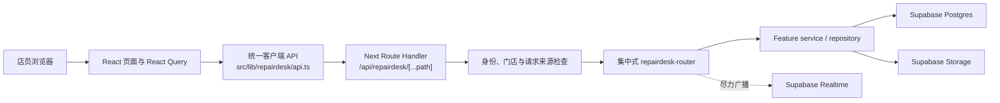
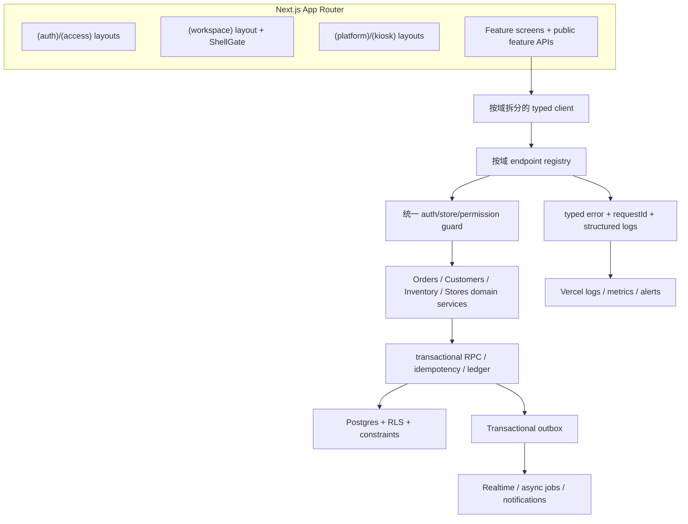

# RepairDesk 全项目体检、架构比较与未来规划

> 日期：2026-07-10
>
> 面向：Chinatech 老板 / 非技术读者
>
> 审计类型：只读代码、配置、测试、文档和本地仓库体检
>
> 结论状态：**有条件通过；适合继续渐进建设，但在扩大多店使用或把系统视为高可靠生产平台前，必须先处理 P1 风险。**

## 0. 2026-07-10 加固执行追踪

本节是原始只读体检后的实施回写。老板新增硬约束为：**不更改已有页面布局和 UI**；本轮只处理服务端、安全、数据正确性、脚本和测试门，另一个 TASK-010 的客户搜索界面调整不属于本任务、不得混入提交。

| 原 P1 项 | 当前状态 | 已完成证据 / 残余边界 |
|---|---|---|
| 客户读取权限 | 已实施，待最终发布 | 六个读取入口在 repository 前检查 `customer:list/detail`；owner/manager/sales 允许，technician/viewer 在没有稳定对象 scope 时 fail closed |
| 邮箱可信源 | 已实施，待最终发布 | 不再信任用户可编辑 `user_metadata.email_verified` 或仅代表任一联系方式确认的 `confirmed_at` |
| 运行时枚举 | 已实施，待最终发布 | order type、approval 使用真实运行时 enum；自定义 workflow status 保留合法 code 格式 |
| 1000 行截断 | 已实施正确性桥接 | orders/inventory/customer fallback 使用稳定批量读取；现阶段以完整性优先，订单分页仍是 O(N) 全量读取后业务排序，真正 SQL 分页留后续 |
| 危险脚本 | 已实施，待最终发布 | seed/reset/import 默认 dry-run、local-only 或精确 target/store/确认/备份门；生产全局清表路径被拒绝 |
| E2E 可信门 | 已修复，最终复跑中 | 统一同源 host、受控 mock dev server、禁止复用任意服务、CI 执行严格业务套件、失败保留 trace |
| 收款原子事务 | 技术切片 PASS，生产门 FAIL | additive ledger + server-only RPC、订单锁、事务级幂等锁、余额/ledger/event/audit 原子写；target schema clone 和 pgTAP 19/19 通过 |
| 设备解锁凭据 | 未完成，正式阻断 | linked 只读计数仍有 1 条明文图案；没有批准的 key-management/retention 决策，不自创密钥、不清理历史值 |

### 新发现的生产 Critical 风险

Owner 授权的 linked 只读核验确认：17 张 `public` 旧表未启用 RLS，同时 `anon` / `authenticated` 具有直接读写权限；其中 `quotes`、`customers_legacy`、`repair_orders_legacy` 有数据和使用统计。这不是本轮代码引入，但已构成可利用的绕过 BFF 路径。盲目统一启用 RLS 又可能中断仍在使用这些表的旧系统，因此必须先做逐表消费者、数据分类和兼容策略，不能自动执行顾问生成的批量 SQL。

### 当前发布判断

- **Payment migration 切片：PASS。** 新 migration 与 linked 当前 UUID schema 兼容，纯 additive，无历史数据回填或删除。
- **正式 Database Application Gate：NO-GO。** 17 表直接暴露、完整历史迁移从零重放失败、真实备份恢复证明缺失。
- **完整 main 推送：NO-GO。** 应用当前依赖尚未上线的付款 RPC；安全顺序必须是 DB expand → 验证 RPC/PostgREST 可见 → 再推应用代码。
- 若老板要走 payment-only 风险降低例外，必须单独接受恢复/旧表暴露风险并记录负责人和期限；这不等于整个数据库安全门通过。

## 1. 一页结论

这不是一个“需要推倒重来”的项目。它已经有一套相当完整的业务系统骨架：工单、客户、库存、回收、消息、设置、门店、平台管理、Kiosk、打印、实时刷新和离线草稿等模块都在同一个 Next.js 项目中；Supabase 负责数据库、身份、文件和实时能力；Vercel 负责部署。

最适合 RepairDesk 的未来方向不是换语言、换框架或立即拆微服务，而是：

> **保留 Next.js + Supabase + Vercel，把当前“大而集中的模块化单体”逐步加固成“边界清楚、关键写入有事务、权限可证明、测试能真实跑业务页面、生产可观察”的模块化单体。**

### 老板现在最需要知道的五件事

1. **基础没有坏。** Lint、TypeScript、679 个单元/集成测试、正式构建全部通过；App Router 页面入口很薄，租户 `store_id`、服务端身份和权限矩阵也已经存在。
2. **最急的是权限“接线”遗漏。** 客户列表、详情、搜索和设备读取 API 没有调用已经定义好的 `customer:list/detail` 权限判断；技术员/只读角色可能看到同一店铺内超出职责范围的客户资料。当前证据不是跨店泄露，但仍属于高优先级隐私问题。
3. **几个关键业务动作不是一个原子事务。** 收款、创建工单、审计日志、邀请使用次数等分多步写入；后一步失败时，前一步可能已经成功，但界面仍报失败，重试可能造成重复或记录不一致。
4. **项目变大后的上限开始出现。** 工单、库存、客户的一些读取有 1000 行上限或先全量读取再内存分页；数据超过阈值后，后面的记录可能“消失”或统计不准。
5. **仓库卫生和质量门有明显技术债。** tracked 副本样式路径达到 998 个，截图与导出约 240 MB；默认 E2E 大量跳过，严格桌面 E2E 当前 10/10 失败，因此“构建绿”还不能等同于“真实业务流程已验证”。

### 总体评分（不是考试分数，而是决策仪表盘）

| 维度 | 现状 | 判断 |
|---|---:|---|
| 产品覆盖 | 8/10 | 核心维修店业务已成形，模块较完整 |
| 技术选型 | 8/10 | Next.js + Supabase 很适合当前团队和规模 |
| 代码组织 | 6/10 | 薄路由是优点，但中心路由、仓储和大页面过重 |
| 权限与隐私 | 5/10 | 基础设计较好，但存在已确认的权限漏接和敏感凭据明文 |
| 数据可靠性 | 5/10 | 有约束/RLS，但关键多步写入、分页和恢复证明不足 |
| 测试可信度 | 6/10 | 单元测试很多，核心仓储覆盖率和真实 E2E 较弱 |
| 运维成熟度 | 4/10 | 缺少统一错误边界、请求 ID、告警与恢复演练证据 |
| 文档与治理 | 6/10 | 规则非常丰富，但副本、过期事实和索引不足 |

## 2. 本次检查了什么、没有检查什么

### 已检查

- 项目入口、20 个页面路由、6 个 Route Handler、17 个 feature 模块。
- Next.js、React、TypeScript、React Query、Supabase、Playwright、Vitest、Storybook、GitHub Actions 配置。
- 浏览器到 API、API 到 service/repository、repository 到 Supabase 的主要调用链。
- 身份、门店上下文、角色权限、RLS、Service Role、公开 Kiosk、审计、设备解锁凭据。
- 48 个迁移文件、数据分页、关键写入一致性、备份/恢复边界。
- UI 壳、响应式、错误/空态、PWA、可访问性、超大组件。
- 测试、覆盖率、E2E、构建、依赖审计、未使用代码、CI、文档和 Git 仓库卫生。
- Next.js、Supabase、Vercel 官方资料，用于比较未来架构方向。

### 原始只读审计阶段没有做

- 没有修改业务代码、数据库、权限、依赖或生产配置。
- 没有部署、推送、写生产数据库或读取生产客户数据。
- 没有把静态审计当成渗透测试、真实负载测试或正式合规认证。
- 原始只读审计没有执行 linked Supabase 查询；后续 TASK-009 已在 Owner 授权范围内执行只读 catalog、advisor、migration list 和 dry-run，结果以上方“执行追踪”为准。

因此，本报告中的“已确认”是本地代码和当前测试可证明的事实；“风险”说明触发条件和可能影响；“线上未知”不能被写成已经安全或已经失败。

## 3. 用小白能理解的方式看当前系统

### 3.1 技术框架

| 部分 | 使用的技术 | 它在店铺里相当于什么 |
|---|---|---|
| 页面和交互 | Next.js 16、React 19、TypeScript、Tailwind/Radix | 店员看见和操作的柜台 |
| 页面数据缓存 | TanStack React Query | 柜台上的临时工作清单 |
| 后端入口 | Next.js Route Handler / BFF | 柜台与仓库之间的内部窗口 |
| 数据库和身份 | Supabase Postgres/Auth | 档案库、员工证件和门禁 |
| 文件 | Supabase Storage | 维修照片、附件、签名的文件柜 |
| 实时刷新 | Supabase Realtime | 多台设备之间的变更通知 |
| 部署 | Vercel | 把系统放到互联网运行的平台 |
| 自动检查 | GitHub Actions、Vitest、Playwright | 上线前的检查清单和试营业 |

### 3.2 当前主要调用链

关键特点：浏览器不直接持有 Service Role；大多数业务数据先通过 Next.js 服务端，再由服务端管理 Supabase。这对复杂维修流程和隐私控制是合理的，但也意味着服务端每一条 `store_id` 和权限判断都必须可证明，不能只依赖“开发者记得加”。

### 3.3 已有业务模块

`account`、`auth`、`buyback`、`capture`、`customers`、`dashboard`、`inventory`、`kiosk`、`messages`、`offline`、`orders`、`platform`、`print`、`realtime`、`settings`、`stores`、`suppliers`。

现有 App Router 页面很薄：20 个 `page.tsx` 合计约 302 行，大部分只是把路由交给 feature screen。这一点方向正确，未来不应退回把业务逻辑塞进 `src/app/*`。

## 4. 量化体检结果

### 4.1 规模

| 指标 | 当前值 | 含义 |
|---|---:|---|
| `src` 下 TS/TSX | 约 447 个文件 / 106,050 行 | 已是正式业务系统，不再是小 demo |
| Feature 模块 | 17 | 业务域基本齐全 |
| 页面路由 / Route Handler | 20 / 6 | 同一 Next 应用同时提供前端和 BFF API |
| Supabase migration | 48 | 数据模型持续演进，必须强化迁移治理 |
| Vitest | 102 个文件 / 679 个测试通过 | 模型和服务端测试基础良好 |
| 总覆盖率 | statements 54.73%，branches 46.12%，lines 57.64% | 中等；不能只看测试数量 |
| 最大文件 | 4,054 行 | 已明显超过项目自身的模块预算 |

### 4.2 核心质量门

| 检查 | 结果 | 解释 |
|---|---|---|
| `npm run agents:check` | 通过 | 项目规则基本可解析 |
| `npm run lint` | 通过 | 未发现当前 ESLint 阻塞 |
| `npm run typecheck` | 通过 | TypeScript 类型检查通过 |
| `npm run test` | 102 files / 679 tests 通过 | 本地单元和集成测试通过 |
| `npm run build` | 通过 | 沙箱内端口权限失败后，在获批环境正式构建成功 |
| `npm run test -- --coverage` | 通过，但覆盖率偏低 | 关键仓储覆盖不足 |
| 默认 `npm run test:e2e` | 10 通过、22 跳过 | 绿色结果不能代表核心业务已跑 |
| `npm run test:e2e:desktop` | 10/10 失败 | POST 被来源检查拒绝，严格业务 E2E 门当前不可用 |
| `npm run build-storybook` | 通过，有警告 | 仅 2 个 story，不能代表组件库被覆盖 |
| `npm run knip` | 失败 | 30 unused files、114 unused exports、依赖声明问题；部分需人工去误报 |
| `npm audit --omit=dev` | 2 个 moderate | 来自 Next 打包的 PostCSS 8.4.31；不应使用 `--force` 盲修 |
| `tools/ai_company.py validate` | 失败 | 12 个 Agent 配置各有一个 ` 2.toml` 副本，造成重名 |
| `git fsck --full` | canonical 对象无损坏 | 但有 24 个 bad-sha1-name 副本和大量 dangling object |

### 4.3 覆盖率最薄弱的关键区域

| 区域 | Statements | Lines | 风险 |
|---|---:|---:|---|
| Orders repository | 3.95% | 4.26% | 最核心业务、文件又最大，回归保护严重不足 |
| Inventory repository | 1.89% | 2.17% | 库存上限、统计和写入风险难被测试发现 |
| Customer repository | 12.09% | 13.35% | 本次客户读权限漏接没有行为测试保护 |
| Kiosk repository | 2.13% | 1.95% | 公开入口攻击面缺少足够回归保护 |
| RepairDesk router | 22.24% | 22.51% | 94 个 case 的中心入口，错误和权限风险集中 |
| Auth context | 5.64% | 6.00% | 身份和邮箱确认逻辑应有更强安全测试 |

结论：不是简单追求“全项目 80%”，而是先给权限、收款、工单创建、库存、公开 Kiosk、迁移边界设置高价值行为测试和分支阈值。

## 5. 做得好的地方

这部分同样重要，因为未来规划应保护已有价值，而不是重写掉。

1. **技术选型与当前规模匹配。** Next.js 模块化单体让一个小团队能同时维护页面和后端；Supabase 降低身份、数据库、存储和实时基础设施成本。
2. **App Router 路由入口薄。** 业务 UI 已主要放在 `src/features/*`，符合渐进拆分方向。
3. **存在集中、默认拒绝的角色矩阵。** `src/server/permissions.ts` 明确 owner、manager、technician、sales、viewer 的 allow/scoped/deny，而不是把角色判断散落在按钮里。
4. **门店隔离基础存在。** 服务端 actor 携带店铺上下文，主要 repository 查询普遍按 `store_id` 过滤；迁移中的公开表启用了 RLS。
5. **浏览器没有直接使用 Service Role。** 高权限密钥保留在 server side，客户端通过 BFF 访问。
6. **POST 有同源和 JSON 请求检查。** 能降低跨站伪造和错误请求格式风险。
7. **敏感响应已有角色投影和审计脱敏。** 说明开发方向已经意识到隐私要求，问题主要是覆盖和生命周期还不完整。
8. **UI 状态并非只做“快乐路径”。** Dashboard、客户、设置等已有 skeleton、空态、错误重试、部分失败提示；移动端还处理了 iOS 16px 输入和 reduced motion。
9. **测试数量和项目规则基础扎实。** 679 个测试、完整构建、设计与多 Agent 规则说明项目已经形成可治理的工程习惯。

## 6. P0 / P1 / P2 风险清单

### 严重度定义

- **P0：立即止损。** 已确认正在造成跨租户泄露、资金错误、数据损坏或系统不可用。
- **P1：下一批必须处理。** 目前未必已经出事故，但触发条件现实，一旦扩大使用会产生隐私、资金、数据或发布风险。
- **P2：计划优化。** 不立即阻断营业，但持续拖慢开发、降低体验或增加长期成本。

### 6.1 P0

本次本地只读审计**没有确认 P0**。没有发现可直接证明的匿名跨租户读取、当前数据损坏或 active secret 泄露。

这不等于线上已经通过安全认证；特别是生产 RLS、migration draft、备份恢复、Storage 对象恢复和平台限流仍需获批后的 live verification。

### 6.2 P1 — 应按顺序处理

#### P1-01 客户读取权限矩阵没有接到 API 路由

- **已确认事实：** `src/server/api/repairdesk-router.ts:781-815,1155-1165` 的客户 list、list-page、get、search、intake-search、devices 没有调用 `customer:list` / `customer:detail` 判断；写操作反而有 assert。
- **设计意图：** `src/server/permissions.ts:289-307,381-399,469-475` 对 technician/viewer 定义为 `scoped`，在没有满足 scope 时应拒绝。
- **实际数据：** customer repository 只按同一 `store_id` 读取，并可能返回姓名、电话、email、notes、设备/IMEI、联系记录和财务汇总。
- **影响：** 同店内的技术员或 viewer 可能看到超出职责范围的客户隐私；当前不是已证实的跨店读取。
- **动作：** 先写行为测试，再在所有客户读入口加统一 assert/scope；测试 owner/manager/sales/technician/viewer、有 grant/无 grant、同店/跨店。
- **验收：** 无 scope 的 technician/viewer 返回 403；允许角色不回归；所有入口共用同一 policy helper。

#### P1-02 SeaTable 导入脚本可全库清表并明文备份 PII

- **已确认事实：** `scripts/import-seatable-riparazione.ts:89-108` 用 Service Role 将相关全库表导出到默认 `/tmp`，随后 delete 没有 `store_id`；`prepareSuppliers` 取第一家店；保护仅为 `--apply --confirm CLEAR_REPAIRDESK` 固定字符串。
- **同类入口：** `db:seed` 没有 dry-run、环境和目标店确认；demo reset 只有布尔 `--confirm` 和默认店 ID，也应一起纳入生产禁用门。
- **影响：** 在错误环境执行可清空所有店铺业务数据，并在共享临时目录留下姓名、电话、IMEI 等明文 JSON。
- **动作：** 立即从普通 npm 工作流隔离；要求显式 target project ref、store id、非 production 默认拒绝、二次随机确认、加密备份路径、行数预览和恢复验证。
- **验收：** 没有 Owner 批准和精确 target 时无法运行；任何 delete 必须限定店铺或在受控全库恢复任务中执行。

#### P1-03 邮箱验证信任可被用户修改的 `user_metadata`

- **已确认事实：** `src/server/auth-context.ts:262-290` 同时信任 canonical confirmation 字段、`app_metadata.email_verified` 和 `user_metadata.email_verified`。
- **风险：** Supabase 官方明确说明 `raw_user_meta_data` 可由认证用户更新，不适合作为授权数据。该判断又影响建店、邀请兑换和入驻门禁。
- **动作：** 只信 `email_confirmed_at`/服务端 canonical user 字段，或仅信服务端控制的 `app_metadata`；补伪造 user_metadata 的负面测试。
- **参考：** [Supabase User Management 官方文档](https://supabase.com/docs/guides/auth/managing-user-data)。

#### P1-04 设备解锁 PIN/密码/图案以明文存储且没有销毁期限

- **已确认事实：** `20260701120000_order_device_unlock_credentials.sql` 直接把 value/pattern 放在 `repair_orders`；repository 只在响应层按角色隐藏，没有列级/应用层加密，也未发现交付后的自动清除。
- **影响：** 数据库、Service Role、备份或内部高权限泄露时，设备凭据会与客户订单一起暴露；风险高于普通联系方式。
- **推荐目标：** 独立 vault 表 + envelope encryption/KMS；显式 reveal endpoint、重新认证/短时令牌、每次查看审计；交付/取消后按 Owner 批准的短窗口销毁；不进入通用列表、缓存、日志和导出。
- **短期止损：** 如果加密方案不能立即上线，至少停止新增明文密码，改为门店一次性纸质/客户现场解锁流程。

#### P1-05 收款、工单创建、邀请和审计不是同一个事务

- **已确认事实：** 收款先更新余额再写 event；创建工单跨客户、设备、订单、事件多步；generic audit 在业务 mutation 后单独插入；邀请 RPC 使用次数递增后再插 invitation。
- **影响：** 后一步失败时，业务可能已成功但 API 报失败；重试可能重复创建，或形成有收款无事件、有业务无审计、邀请码已占用但邀请不存在。
- **动作：** 对收款、退款、工单创建、角色/邀请变化建立数据库 transaction/RPC；加入 idempotency key、immutable payment ledger、transactional audit/outbox。
- **验收：** 人为让每一个后续步骤失败时，数据库要么全部提交，要么全部回滚；同一 idempotency key 重试只产生一个结果。

#### P1-06 工单、库存和客户存在 1000 行截断/内存分页风险

- **工单：** `order.repository.ts:783-893` 的数据库路径没有 `.range()`，读取后才在 JS slice；Supabase API 默认 `max_rows=1000`，匹配记录超过 1000 时后页会缺失。
- **库存：** `inventory.repository.ts:65-105` 固定 `.limit(1000)`，page API 只是外层包装；超过阈值后记录不可见，汇总也可能错误。
- **客户：** legacy list 同样 `.limit(1000)`；分页 RPC 路线较好，但 fallback/其他读取仍需统一审查。
- **动作：** 所有列表采用数据库 count + order + range/cursor；统计用 SQL/RPC；为 1001、1500、分页边界和相同时间戳增加测试。
- **参考：** [Supabase range 官方文档](https://supabase.com/docs/reference/javascript/using-modifiers-range)。

#### P1-07 Offline draft 迁移的文档意图与 migration history 证据冲突

- **文档意图：** 两个 migration 文件自称 local draft / do not apply，Phase 5 文档也要求排除。
- **已有证据：** 前一任务在 2026-07-10 记录 linked migration local/remote 全部对齐、remote count 48，而当前本地也有 48 个 migration。
- **判断：** 这强烈暗示两个 draft 版本已经进入 remote history，但不能只凭计数断言其对象真实存在；历史登记和真实 schema 可能不同。
- **动作：** 在任何新 DB apply 前，Owner 批准串行运行 migration list、catalog/object query、function grants 和 dry-run；把结果写回唯一事实源。
- **Gate：** 未澄清前，不得把 offline draft 称为“确认未上线”，也不得继续自动 `db push`。

#### P1-08 备份、Storage 恢复和生产观测尚无完整证明

- **事实：** Supabase 数据库备份不包含 Storage bucket 中的对象；数据库恢复并不自动恢复维修照片、签名和附件文件。
- **现状：** 项目文档已经把 live query pack、backup/restore proof、rollback/observability runbook 列为发布门，但本次没有当前生产验证。
- **动作：** 明确 RPO/RTO；单独备份对象及 metadata；季度做隔离恢复演练；记录校验和、恢复时长和负责人。
- **参考：** [Supabase Backups 官方文档](https://supabase.com/docs/guides/platform/backups)。

#### P1-09 E2E 绿色结果不证明业务页面可用

- **默认门：** 32 个 declared test 中 10 通过、22 跳过；workflow 只支持手动触发，许多 spec 需要环境变量；部分 smoke 允许登录页也通过或直接 skip。
- **严格门：** `test:e2e:desktop` 本次 10/10 失败。错误快照显示订单页壳已打开，但 POST 返回“请求来源无效”，所以业务队列没有加载；这是测试环境/来源配置失败，不是已经确认的布局回归。
- **动作：** 每条受保护业务测试先 fail-on-login；mock E2E 使用可控开发服务，production build 单独验证；再建立隔离 test Supabase 的关键 happy path。
- **验收：** PR 必跑登录、建单、打开详情、收款模拟、客户权限负面测试；失败时有 trace/screenshot，但不直接覆盖 tracked 证据图。

#### P1-10 仓库副本和证据文件已经影响治理可信度

- **统计口径：** tracked 全量有 998 个副本样式路径；默认可见扫描有 461 个 basename 形如 `… 2.ext`，两个数字不可相加。
- **分布：** `.ai-company` 518、`.codex` 27、screenshots 290、exports 128、docs 12、src 8、tests 11、其他 4。
- **体积：** 778 个 tracked screenshot 约 152.49 MiB；604 个 tracked export 约 88.07 MiB；`.git` 约 172 MiB。
- **影响：** Agent 名称重复导致治理校验失败；文档副本出现相反事实；测试会改 tracked 截图；源码/测试副本可能被误改或误执行。
- **动作：** 不在当前 dirty worktree直接删除。先迁移/新建干净 clone，生成 SHA256 + canonical manifest，逐类审批归档；E2E 改写 `testInfo.outputPath()`；GitHub 只保留代码和精选脱敏证据。

#### P1-11 浏览器、Kiosk、审计和附件缺少统一的数据保留/清除生命周期

- **浏览器：** offline order service 允许姓名、电话、email、IMEI、维修问题和诊断进入 IndexedDB；虽有 cleanup 实现，但未发现生产调用者，退出登录也没有清理。
- **Kiosk：** session JSON 可保留签名 data URL 和客户表单；过期主要改状态，没有清空敏感 payload。
- **审计：** 当前 denylist 会遮蔽明显密码字段，但 `issue_description`、`diagnosis_result`、`warranty_text` 等短自由文本仍可能进入 audit。
- **影响：** 共享店铺电脑、本机访问、XSS、日志/备份泄露或长期保留会扩大隐私暴露面。
- **动作：** 建立 retention registry，明确每类数据的目的、保存期、删除触发器、备份影响和责任人；在同步成功、丢弃、退出、工单关闭、Kiosk 过期时调用域级清理。历史数据清理仍需另行批准和恢复演练。

### 6.3 P2 — 进入季度计划

#### P2-01 中心文件和跨 feature 依赖过重

- `repairdesk-router.ts` 有约 94 个 case；客户端 API facade 约 94 个函数；schema 中心文件约 87 个 schema。
- 人工扫描发现生产 feature 文件中约 85 个跨 feature 深层 import；`src/entities` 仅约 47 行且几乎没有承担跨域规则。
- 建议按 orders/customers/inventory/stores/platform/kiosk 拆 endpoint registry、schema、service 和公共接口；禁止新深层跨 feature import，并用 lint/architecture test 固化。

#### P2-02 超大页面和仓储超出项目自身预算

最大的 `order-detail-screen.tsx` 4,054 行、`settings-screen.tsx` 3,903 行、`inventory-screen.tsx` 3,133 行、`order.repository.ts` 3,054 行、`buyback-quote-workspace.tsx` 2,435 行。

不要按“每 300 行机械切文件”，而要按业务切片拆：query/orchestration、header/KPI、desktop/mobile list、详情 panel、dialog/form、纯 model。每拆一片立即跑测试和浏览器回归。

#### P2-03 错误协议泄露内部信息且 HTTP 分类不足

`repairdesk-router.ts:551-566` 除 401/403 外，大多数错误把原始 `Error.message` 作为 HTTP 400 返回。数据库、Storage 或内部实现细节可能泄露；运维也无法区分用户错误、冲突和服务器故障。

建议统一 `{ code, message, requestId, fieldErrors? }`；客户端只显示安全文案，服务端记录脱敏 cause；合理使用 400/404/409/422/429/500/503。

#### P2-04 缺少 App Router 错误边界和正式可观察性

当前只有 `not-found.tsx`，没有 `error.tsx`、`global-error.tsx`、route `loading.tsx`；也没有 `instrumentation.ts` 和统一 observability 模块。

建议先补 workspace/root error boundary、request ID 和结构化日志，再接错误率、延迟、失败动作、队列积压、数据库错误和告警。参考 [Next.js Error Handling](https://nextjs.org/docs/app/getting-started/error-handling)、[Instrumentation](https://nextjs.org/docs/app/guides/instrumentation) 和 [Vercel Observability](https://vercel.com/docs/observability)。

#### P2-05 应用壳用 pathname 白名单，注册完成和平台状态会穿错壳

`src/app/providers.tsx:32-46` 只排除五个路径；`/register/complete` 因此加载 Sidebar/AppBar/Realtime。现有截图也显示注册完成卡片周围出现工作台壳。平台管理员/未开通用户还可能看到不适合其状态的业务导航，尽管服务端仍会拒绝数据。

建议先做 `ShellGate`，再用 Next route groups 把 `(auth)`、`(access)`、`(workspace)`、`(platform)`、`(kiosk)`、`(fallback)` 分开，URL 不变。参考 [Next.js Project Structure / Route Groups](https://nextjs.org/docs/app/getting-started/project-structure)。

视觉证据：[`register-complete-mobile.png`](../screenshots/TASK-20260710-007-email-link-registration-completion/register-complete-mobile.png)。

#### P2-06 当前 PWA 是离线提示和本机草稿，不是完整 offline-first

Service Worker 只缓存 `/offline` 和图标；`/offline` 还会经过认证 proxy；outbox runner 没有生产 consumer。短期推荐“小店稳健在线模式”：公开、自包含的 offline fallback + 本机草稿恢复 + 恢复网络后手动提交。除非真实断网频率和损失证明值得投入，否则暂不做完整 offline-first。

#### P2-07 可访问性和组件验证不足

- 移动 AppBar 搜索按钮的可见文字被隐藏，按钮没有 `aria-label`，屏幕阅读器无名称。
- 通知按钮有标签但没有动作，容易制造错误预期。
- Storybook 安装 a11y addon，但只有 2 个 story，CI 不构建/测试 Storybook；没有 axe/jsx-a11y gate。

这是快速收益项：补 aria-label、隐藏未实现动作、为核心表单/状态组件补 story 和 a11y 测试。

#### P2-08 Realtime 广播是 best-effort，存在 serverless 事件丢失窗口

业务提交后使用 `void ...catch(() => undefined)` 发送广播。请求完成后运行实例可能结束，导致少数缓存失效通知丢失。广播本身不是数据事实源，所以不是资金 P1；未来可用 transactional outbox，或在适合的非关键通知上使用 Next `after`，参考 [Next.js after](https://nextjs.org/docs/app/api-reference/functions/after)。

#### P2-09 依赖和死代码治理需要纳入 CI

- `knip` 报 30 unused files、1 unused dependency `recharts`、114 unused exports、112 unused types；其中含误报，不能自动删除。
- scripts/tests 直接 import `sharp`、`ws`，但它们只是 Next/Storybook 的传递依赖，安装可重复性不足。
- Next 内部 PostCSS 8.4.31 有 2 个 moderate advisory；项目不接收用户 CSS，实际可利用性较低，但应跟踪上游安全升级，不用 `npm audit fix --force`。

参考 [GitHub Advisory GHSA-qx2v-qp2m-jg93](https://github.com/advisories/GHSA-qx2v-qp2m-jg93)。

#### P2-10 文档丰富但缺少唯一入口和生命周期

顶层 docs 约 55 个，副本中有内容冲突；根目录没有 README/docs index。建议建立“当前事实源 / 执行中 / 历史归档”三层索引，并给关键文档统一 `Status`、`Owner`、`Last reviewed`、`Supersedes`。

#### P2-11 公开 Kiosk 和 API 需要专门的抗滥用层

Kiosk 配对码是 8 位十六进制（32 bit）、有效期 15 分钟；公开路由未见应用级速率限制，匿名错误还可能包含底层消息。建议增加 IP、device、code hash 三维限流和指数退避，统一“不存在/过期/已使用”错误，并验证并发 claim 只成功一次。是否已有 Vercel Firewall 规则属于线上未知。

#### P2-12 数据契约仍大量依赖 `select("*")` 和弱类型转换

静态扫描约有 238 次 `DbRecord`、168 次 `as DbRecord`、79 次 `.select("*")`；中央 `types.ts` 约 1,484 行。这样容易让数据库字段变化悄悄进入浏览器响应。建议生成 Supabase `Database` 类型、使用显式列选择、行 mapper 和按域 DTO，特别是客户、工单和附件敏感响应。

#### P2-13 上传、响应头和供应链防线仍可加强

- 附件已有私有 bucket、大小/MIME allowlist 和 magic-byte 检查，这是优点；但部分扩展名仍优先取原文件名，尚无恶意 PDF/EXIF/长期保留策略。
- `next.config.ts` 未见统一 CSP、HSTS、X-Content-Type-Options、Referrer-Policy、Permissions-Policy；应在不破坏扫码、相机和 Kiosk 的前提下逐项 report-only/灰度启用。
- GitHub Actions 使用浮动 major tag，未见 Dependabot/Renovate、CodeQL/secret scan 或定期 SCA。应先加只读报告，再把高置信结果升级为门禁。

## 7. 架构方案比较

### 方案 A：保持当前集中式单体，不做结构调整

| 项目 | 评价 |
|---|---|
| 优点 | 成本最低；短期功能开发最快；部署简单 |
| 缺点 | router/repository/screen 继续膨胀；权限和事务遗漏概率上升 |
| 适用 | 仅用于 1–2 周止血，不适合作为 1 年目标 |
| 风险 | 技术债会把每次小改动变成高风险改动 |

### 方案 B：渐进式加固模块化单体（推荐）

| 项目 | 评价 |
|---|---|
| 核心 | 保留 Next.js/Supabase/Vercel；按业务域拆接口和写入边界；关键动作使用 DB transaction/RPC |
| 优点 | 最符合小团队；不需要双系统迁移；可逐片回滚；维护成本可控 |
| 缺点 | 需要 2–3 个月持续治理，短期看不到“全新系统”的视觉刺激 |
| 适用 | 当前 Chinatech，以及未来多个独立合作店的共享平台 |
| 风险控制 | 单一写入者、小步 PR、每片测试、feature flag/兼容 facade |

### 方案 C：浏览器更多直接访问 Supabase，Next 只保留少量后端

| 项目 | 评价 |
|---|---|
| 优点 | 少写一部分 BFF 代码；简单列表可利用 RLS 和 realtime |
| 缺点 | 复杂收款/权限/审计/跨表事务更难统一；客户端数据合同和 RLS 维护压力大 |
| 适用 | 少量低风险、只读、RLS 已证明的查询 |
| 判断 | 可作为局部优化，不适合把整个 RepairDesk 改成 client-direct |

### 方案 D：微服务、每店独立数据库或微前端

| 项目 | 评价 |
|---|---|
| 优点 | 极大规模时可独立扩容/隔离；企业客户可提供独立环境 |
| 缺点 | 部署、监控、身份、消息一致性、数据库迁移和排障成本数倍增加 |
| 触发条件 | 独立团队负责不同域、明确 SLA/合规隔离、共享 DB 已成真实瓶颈、企业客户愿意承担成本 |
| 判断 | 当前不做；过早拆分会比现有问题更危险 |

### 数据隔离方案单独比较

| 方案 | 当前建议 | 原因 |
|---|---|---|
| 共享数据库 + 强制 `store_id` + RLS/BFF 双防线 | **推荐并保持** | 成本低、升级统一、符合已批准的平台方向 |
| 每店一个 schema | 不推荐 | 迁移和查询工具复杂，收益小于成本 |
| 每店一个数据库/项目 | 未来企业选项 | 隔离强，但备份、升级、监控和费用线性增长 |

Supabase 官方建议暴露 schema 的表启用 RLS；Service key 可绕过 RLS，不能暴露给浏览器。本项目应继续把 RLS 当防线，把 BFF 的 tenant/permission guard 当另一条可测试防线，而不是二选一。参考 [Supabase RLS](https://supabase.com/docs/guides/database/postgres/row-level-security) 和 [Securing your API](https://supabase.com/docs/guides/api/securing-your-api)。

## 8. 推荐目标架构

### 目标原则

1. **单体部署，模块边界清楚。** 仍然一次部署，但 orders/customers/inventory/stores 不再依赖一个 94-case 大开关。
2. **权限先于 repository。** 每个 endpoint 必须声明 action、store requirement、scope resolver；缺省拒绝。
3. **关键业务一次提交。** 资金、工单创建、角色和邀请必须 transaction + idempotency。
4. **数据事实与通知分离。** Postgres 是事实源；Realtime 只是刷新信号；需可靠通知时用 outbox。
5. **错误对用户安全、对运维可诊断。** 用户收到 code/message/requestId，内部 cause 只进脱敏日志。
6. **普通查询尽量受 RLS 保护。** Service Role 只做确有必要的服务端特权动作；如果继续用 Service Role，所有 tenant guard 必须有负面测试。
7. **异步能力按需求引入。** OCR、批量导入、导出、消息、保留清理可进入 worker/queue；核心收款和状态变更不拆成微服务。

Next.js 官方也建议明确 Server/Client Component 边界，并把 provider 尽量放深，避免不必要地扩大客户端图。参考 [App Router](https://nextjs.org/docs/app) 和 [Server and Client Components](https://nextjs.org/docs/app/getting-started/server-and-client-components)。

## 9. 分阶段路线图

### 第 0 阶段：0–7 天，先止住真实风险

| 顺序 | 工作包 | 预计量级 | 完成标准 |
|---:|---|---:|---|
| 1 | 客户读权限行为测试 + 所有路由 gate | S | 五角色、scope/grant、同店/跨店测试通过 |
| 2 | 隔离 SeaTable 清库脚本 | S | production 默认拒绝、精确 project/store、备份加密和恢复门 |
| 3 | 移除 `user_metadata.email_verified` 信任 | S | 伪造 metadata 不能越过建店/邀请 gate |
| 4 | 修正 `order_type/status` Zod enum | S | 任意字符串被 schema 直接拒绝；补有效/无效测试 |
| 5 | 修复 orders/inventory/customer 分页上限 | M | 1001+ 数据测试和 count/range 正确 |
| 6 | 修复严格 E2E 环境和 fail-on-login | M | 至少一个真实订单业务 smoke 在 PR 稳定运行 |

特别说明：本次已用有效 payload 复现 `createOrderSchema` 接受 `order_type: "not_a_real_type"`。类型断言 `as z.ZodType<RepairOrderType>` 只骗过 TypeScript，不会产生运行时 enum 校验。

### 第 1 阶段：第 2–4 周，让数据和发布结果可信

- 决定并实施设备解锁凭据的停止明文/加密/查看/销毁策略。
- 把收款和工单创建迁移到 transaction/RPC + idempotency；先做 payment ledger。
- 统一错误 envelope、request ID、结构化脱敏日志；补 root/workspace error boundary。
- 把 `/register/complete`、onboarding、platform、workspace 分壳；先 ShellGate，后 route groups。
- 让 `/offline` 成为公开、自包含 fallback；明确产品文案不是完整离线系统。
- 冻结新 ` 2` 文件和 E2E 写 tracked screenshot；建立仓库清理 manifest。
- Owner 批准后串行执行 migration draft/live object、RLS/grant、Storage policy 和 backup preflight。

### 第 2 阶段：第 2 个月，降低每次改动的风险

- 按域拆 `repairdesk-router`、client API、schema 和 shared types，保留兼容 facade。
- 先拆 `order-detail`、`settings`、`inventory` 三个最大 screen；每次只拆一个业务切片。
- 为 orders/customer/inventory/kiosk/auth 设置覆盖率基线和逐步提升阈值。
- 在 CI 增加 `agents:check`、核心 E2E smoke、migration reset/contract test、选择性 knip。
- 为核心表单、错误、空态、无权限状态补 Storybook + axe；加入 WebKit/Safari 重点流程。

### 第 3 阶段：第 3 个月，建立可运营的生产平台

- 上线关键业务指标、错误率、延迟、数据库错误、报警责任人和回滚流程。
- 完成数据库 + Storage 对象的隔离恢复演练，记录 RPO/RTO。
- 通过 transactional outbox 处理可靠通知、审计和异步动作。
- 完成角色 Phase D2 的字段级/历史/金额投影；实现有时限、可审计的平台支持访问。
- 建立 authenticated 390/430/768/1024/1440 浏览器矩阵和真实 iPad kiosk 验证。

### 6–12 个月，按业务增长触发

- 门店生命周期：暂停、导出、删除、Owner 转移、结算和保留策略。
- feature flags、灰度发布、店铺级配置和平台运营指标。
- OCR/批量导入/消息/导出/保留清理进入异步 job；需要时再引入队列。
- 先稳定数据和权限，再做 AI 自动摘要、报价辅助、图片识别和经营建议。
- 只有共享数据库、团队或合规出现真实瓶颈时，才评估企业店独立数据库/服务。

## 10. 建议的首批独立任务合同

为了避免“大重构做半年”，下一步应拆成可验收的小任务：

1. **SEC-01 客户读权限修复**：只改 router/policy tests；不同时重构 repository。
2. **OPS-01 破坏脚本隔离**：只处理 SeaTable/seed/reset 的环境、target、确认和备份门。
3. **AUTH-01 邮箱确认可信源**：只改 auth context 与负面测试。
4. **DATA-01 列表分页正确性**：orders、inventory、customer 分三个 PR；每个用 1001+ fixture 验证。
5. **DATA-02 Payment transaction/ledger**：先固定收款，再扩到 refund/order create。
6. **SEC-02 Unlock credential lifecycle**：先由 Owner 决定保留窗口和店内流程，再设计加密。
7. **QA-01 E2E 可信门**：fail-on-login、稳定 mock server、测试 artifact 隔离、PR smoke。
8. **ARCH-01 Route groups/ShellGate**：先不改变 URL/业务逻辑，只解决壳与身份状态。
9. **REPO-01 副本清理批准包**：干净 clone + manifest + hash；不在当前 dirty worktree 直接删。
10. **OPS-02 Production proof**：Owner 批准后运行 migration/RLS/grant/backup/restore/Storage query pack。

## 11. 哪些事情现在不要做

- 不要重写成另一个前端或后端框架。
- 不要现在拆微服务、微前端或每店一个数据库。
- 不要用 `npm audit fix --force` 解决 PostCSS advisory。
- 不要在当前有用户资产的 dirty worktree 批量删除 ` 2`、截图、exports 或 Git 对象。
- 不要把本地测试通过写成“生产数据库和备份已认证”。
- 不要在权限、事务、敏感凭据和恢复没稳定前，优先做大量 AI 功能。
- 不要承诺完整离线业务，除非愿意承担幂等、冲突、敏感字段和后台同步的完整成本。

## 12. 风险与发布门

### 当前可继续的工作

- 本地 UI 优化、纯组件拆分、测试补强、文档索引、非生产工具治理。
- 在独立分支/干净 worktree 中逐项实现 P1，并保持最小兼容变更。

### 当前不建议直接扩大多店或高可靠承诺

在以下项目完成前，安全/数据复核结论为 **NO-GO for scale-up**：

- 客户读取权限漏接修复并有负面测试。
- 明文设备解锁凭据的 Owner-approved 处理方案。
- 破坏性脚本 production gate。
- 收款/关键写入事务性和幂等保护。
- migration draft 线上状态、RLS/grants、备份/恢复、Storage 对象恢复得到当前证据。
- E2E 能证明真实业务页面加载，而不是登录页/skip。

### 仍需线上确认的未知

- 当前生产 migration versions 和两个 offline draft 对象是否真实存在。
- 所有生产公开表、view、function、Storage bucket policy 的实际 grants/RLS。
- Vercel 当前错误率、p95/p99 延迟、告警、日志保留和 branch protection。
- Supabase 套餐对应备份频率、实际恢复耗时、Storage 文件恢复能力。
- 真实店员角色、Safari/iPhone/iPad、断网和慢网下的端到端行为。

## 13. 仓库与视觉证据说明

本任务是只读体检和报告，没有创建或改变业务页面，因此**无新任务页面可截图**。替代证据包括：本报告、任务 evidence、质量门命令和现有注册完成页截图。现有截图仅用于证明“注册完成页穿入工作台壳”的 UX 发现，不代表本任务修改后的结果。

- 现有视觉证据：[`screenshots/TASK-20260710-007-email-link-registration-completion/register-complete-mobile.png`](../screenshots/TASK-20260710-007-email-link-registration-completion/register-complete-mobile.png)
- 本任务证据：[`TASK-20260710-009-security-reliability-hardening-release/EVIDENCE.md`](../.ai-company/memory/tasks/TASK-20260710-009-security-reliability-hardening-release/EVIDENCE.md)

## 14. 术语小字典

| 术语 | 简单解释 |
|---|---|
| 模块化单体 | 一个系统一次部署，但内部按业务分房间，不是所有东西堆在一起 |
| BFF | 专门给这个网页使用的后端入口 |
| RLS | 数据库自己判断“这条记录你能不能看” |
| Service Role | 能绕过普通数据库门禁的高权限服务密钥 |
| 事务 | 多个数据库动作要么全部成功，要么全部失败 |
| 幂等 | 同一个请求重试多次，结果仍只发生一次 |
| Outbox | 把“业务成功后要发的事件”与业务写入一起可靠记录 |
| E2E | 像真人一样从浏览器走完整流程的测试 |
| RPO/RTO | 最多能丢多久的数据 / 最长能停机多久 |
| P0/P1/P2 | 立即止损 / 下一批必须修 / 计划优化 |

## 15. 官方参考

- [Next.js App Router](https://nextjs.org/docs/app)
- [Next.js Project Structure and Route Groups](https://nextjs.org/docs/app/getting-started/project-structure)
- [Next.js Server and Client Components](https://nextjs.org/docs/app/getting-started/server-and-client-components)
- [Next.js Error Handling](https://nextjs.org/docs/app/getting-started/error-handling)
- [Next.js Instrumentation](https://nextjs.org/docs/app/guides/instrumentation)
- [Supabase Row Level Security](https://supabase.com/docs/guides/database/postgres/row-level-security)
- [Supabase Securing your API](https://supabase.com/docs/guides/api/securing-your-api)
- [Supabase Backups](https://supabase.com/docs/guides/platform/backups)
- [Supabase Local Development and Migrations](https://supabase.com/docs/guides/local-development/overview)
- [Supabase Deployment and Branching](https://supabase.com/docs/guides/deployment)
- [Vercel Observability](https://vercel.com/docs/observability)
- [Vercel Runtime Logs](https://vercel.com/docs/logs/runtime)

## 16. 最终建议

如果只做一个决定：**选择方案 B——渐进式加固模块化单体。**

如果只启动一个任务：**先修客户读取权限，并用五种角色的负面/正面行为测试证明。**

如果只设一个管理原则：**以后每一个功能都要同时回答四个问题——谁能做、属于哪家店、失败能否回滚、如何证明它真的工作。**
